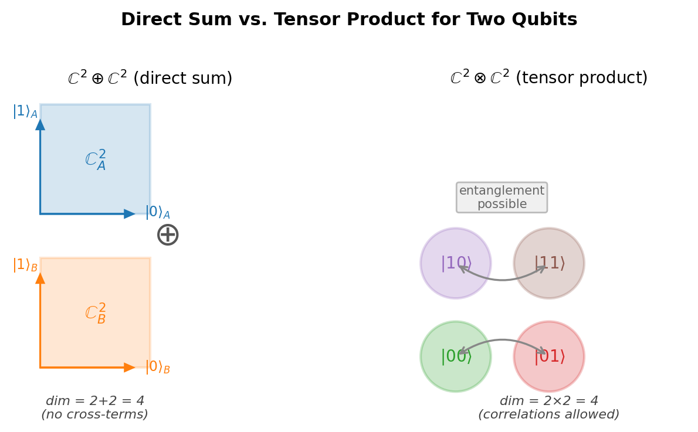
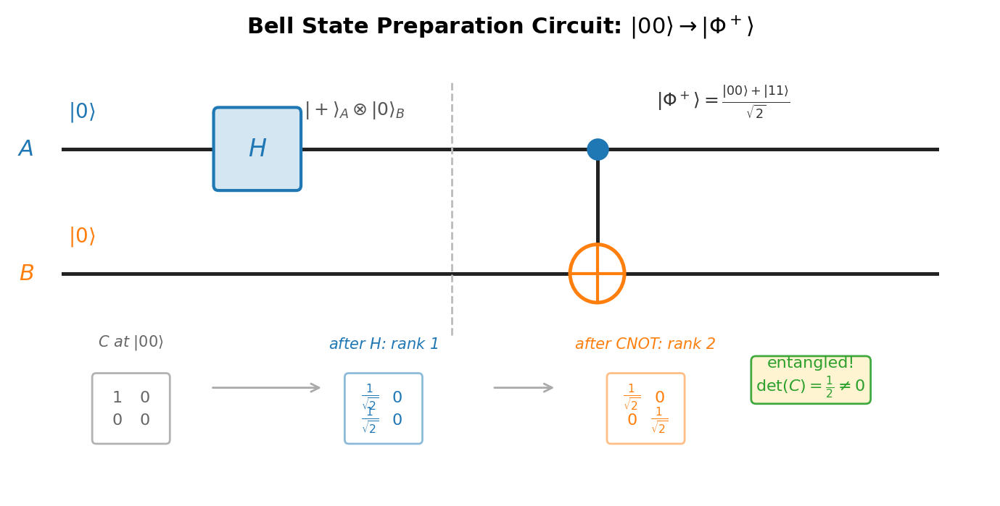
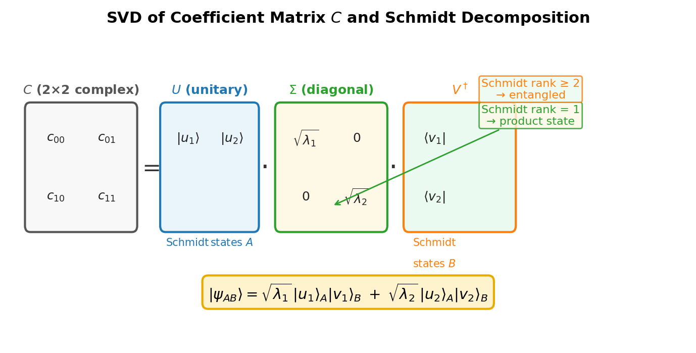

# Chapter 2 — Composite Systems and Entanglement
*Why two qubits live in a four-dimensional space where most states cannot be written as products — and what that means.*

You have two spin-$\frac{1}{2}$ particles. Each lives in a two-dimensional Hilbert space. A reasonable person might expect the joint system to be described by two independent two-dimensional state vectors — four numbers in total, two per particle. That sounds right. It is wrong.

The joint Hilbert space is not two two-dimensional spaces placed side by side (a direct sum, six dimensions if the particles were different sizes). It is the tensor product — a four-dimensional space in which most vectors do not correspond to any product of single-particle states. The extra structure that tensor product gives you, compared to the direct sum, is precisely where entanglement lives. And entangled states are, in a precise sense, more typical than product states: if you choose a random unit vector in $\mathbb{C}^4$, it is almost certainly entangled.

This chapter is about the geometry of that space. How do you tell a product state from an entangled one? How much entanglement does a state carry? And what does the answer look like in practice?

---

## The Tensor Product

Let system $A$ have Hilbert space $\mathcal{H}_A = \text{span}\{|0\rangle_A, |1\rangle_A\}$ and system $B$ have $\mathcal{H}_B = \text{span}\{|0\rangle_B, |1\rangle_B\}$. The joint system lives in the **tensor product**:

$$\mathcal{H}_A \otimes \mathcal{H}_B = \text{span}\{|00\rangle, |01\rangle, |10\rangle, |11\rangle\},$$

where $|ij\rangle$ abbreviates $|i\rangle_A \otimes |j\rangle_B$. The dimension is $2 \times 2 = 4$.

A general state is:

$$|\psi_{AB}\rangle = c_{00}|00\rangle + c_{01}|01\rangle + c_{10}|10\rangle + c_{11}|11\rangle,$$

with $\sum_{i,j}|c_{ij}|^2 = 1$. The four coefficients can be arranged into the **coefficient matrix**:

$$C = \begin{pmatrix}c_{00} & c_{01} \\ c_{10} & c_{11}\end{pmatrix}.$$

This $2\times2$ complex matrix of unit Frobenius norm encodes everything about the state. Whether the state is entangled, how much it is entangled, and what the local reduced state of each qubit looks like — all of it is determined by $C$.

The dimension $4 = 2\times2$, not $2+2$, is the first thing to internalize. For a qubit and a qutrit, the joint space is $2\times3 = 6$-dimensional, not 5. The product rule reflects the physical fact that two independent systems can be in any combination of their individual states, and the number of independent combinations is the product of the individual dimensions. A direct sum would give you two independent quantum systems that cannot correlate at all. The tensor product gives them the ability to correlate — and, in particular, to be entangled.

<!-- → [FIGURE: diagram contrasting direct sum vs. tensor product for two qubits — showing ℂ² ⊕ ℂ² as two separate planes (4 real dimensions, no cross-terms) vs. ℂ² ⊗ ℂ² as a four-dimensional space with the four basis states |00⟩, |01⟩, |10⟩, |11⟩; the visual goal is to make viscerally clear that ⊗ is larger and allows correlations that ⊕ forbids] -->


*Figure 2.1 — diagram contrasting direct sum vs. tensor product for two qubits — showing ℂ² ⊕ ℂ² as two separate planes (4 real dimensions, no…*

---

## Product States and the Rank-1 Test

A state $|\psi_{AB}\rangle$ is a **product state** if it factors:

$$|\psi_{AB}\rangle = |a\rangle_A \otimes |b\rangle_B \quad \text{for some } |a\rangle \in \mathcal{H}_A,\; |b\rangle \in \mathcal{H}_B.$$

Write $|a\rangle = \alpha|0\rangle + \beta|1\rangle$ and $|b\rangle = \gamma|0\rangle + \delta|1\rangle$. Then:

$$|a\rangle\otimes|b\rangle = \alpha\gamma|00\rangle + \alpha\delta|01\rangle + \beta\gamma|10\rangle + \beta\delta|11\rangle.$$

The coefficient matrix of this product state is:

$$C_\text{sep} = \begin{pmatrix}\alpha\gamma & \alpha\delta \\ \beta\gamma & \beta\delta\end{pmatrix} = \begin{pmatrix}\alpha \\ \beta\end{pmatrix}\begin{pmatrix}\gamma & \delta\end{pmatrix}.$$

This is a **rank-1 matrix** — the outer product of two vectors. The determinant of a rank-1 matrix is zero: $\det(C_\text{sep}) = \alpha\gamma\cdot\beta\delta - \alpha\delta\cdot\beta\gamma = \alpha\beta\gamma\delta - \alpha\beta\delta\gamma = 0$.

Conversely, if $C$ has rank 1, then $C = \vec{u}\vec{v}^T$ for some vectors $\vec{u}$ and $\vec{v}$, and the state factors as $|a\rangle = u_0|0\rangle + u_1|1\rangle$ tensored with $|b\rangle = v_0|0\rangle + v_1|1\rangle$. The conclusion: **for two qubits, $|\psi_{AB}\rangle$ is a product state if and only if $\text{rank}(C) = 1$, equivalently $\det(C) = 0$.**

This gives the fastest computational test for entanglement:

$$\det(C) = c_{00}c_{11} - c_{01}c_{10}.$$

If $\det(C) \neq 0$, the state is entangled.

Two examples. For $|\psi\rangle = \tfrac{1}{\sqrt{2}}(|00\rangle + |11\rangle)$: $C = \tfrac{1}{\sqrt{2}}\bigl(\begin{smallmatrix}1&0\\0&1\end{smallmatrix}\bigr)$, $\det(C) = \tfrac{1}{2} \neq 0$ — entangled. For $|\phi\rangle = \tfrac{1}{\sqrt{2}}(|00\rangle + |10\rangle) = |{+}\rangle_A\otimes|0\rangle_B$: $C = \tfrac{1}{\sqrt{2}}\bigl(\begin{smallmatrix}1&0\\1&0\end{smallmatrix}\bigr)$, $\det(C) = 0$ — separable. The factored form $|{+}\rangle\otimes|0\rangle$ confirms it.

---

## The Bell States

The four **Bell states** are an orthonormal basis of maximally entangled two-qubit states:

$$|\Phi^\pm\rangle = \frac{1}{\sqrt{2}}\bigl(|00\rangle \pm |11\rangle\bigr), \qquad |\Psi^\pm\rangle = \frac{1}{\sqrt{2}}\bigl(|01\rangle \pm |10\rangle\bigr).$$

Each has a coefficient matrix proportional to a Pauli matrix or the identity, all with rank 2. For $|\Phi^+\rangle$: $C = \tfrac{1}{\sqrt{2}}\bigl(\begin{smallmatrix}1&0\\0&1\end{smallmatrix}\bigr)$, $\det(C) = \tfrac{1}{2}$. For $|\Psi^-\rangle$: $C = \tfrac{1}{\sqrt{2}}\bigl(\begin{smallmatrix}0&1\\-1&0\end{smallmatrix}\bigr)$, $\det(C) = \tfrac{1}{2}$.

The reduced density matrix of qubit $A$ in any Bell state is $\hat\rho_A = \text{Tr}_B(|\psi\rangle\langle\psi|) = \tfrac{1}{2}\hat{I}$ — the maximally mixed state. No single-qubit measurement distinguishes among the Bell states. All the information is in the joint correlations. This is the defining feature of maximal entanglement: learning the local state of one party tells you nothing; all the information is shared.

**Preparing $|\Phi^+\rangle$ from $|00\rangle$** uses two gates:

$$|00\rangle \xrightarrow{H\otimes I} \frac{|00\rangle + |10\rangle}{\sqrt{2}} = |{+}\rangle_A\otimes|0\rangle_B \xrightarrow{\text{CNOT}} \frac{|00\rangle + |11\rangle}{\sqrt{2}} = |\Phi^+\rangle.$$

After the Hadamard the state is still a product — $|{+}\rangle\otimes|0\rangle$ factors. The CNOT creates the entanglement. All four Bell states are reachable from the four computational basis states by this same circuit:

| Initial | After $H\otimes I$ | After CNOT | Bell state |
|:-------:|:-----------------:|:----------:|:----------:|
| $|00\rangle$ | $|{+}\rangle|0\rangle$ | $|\Phi^+\rangle$ | $(|00\rangle+|11\rangle)/\sqrt{2}$ |
| $|01\rangle$ | $|{+}\rangle|1\rangle$ | $|\Psi^+\rangle$ | $(|01\rangle+|10\rangle)/\sqrt{2}$ |
| $|10\rangle$ | $|{-}\rangle|0\rangle$ | $|\Phi^-\rangle$ | $(|00\rangle-|11\rangle)/\sqrt{2}$ |
| $|11\rangle$ | $|{-}\rangle|1\rangle$ | $|\Psi^-\rangle$ | $(|01\rangle-|10\rangle)/\sqrt{2}$ |

The singlet $|\Psi^-\rangle = \tfrac{1}{\sqrt{2}}(|01\rangle - |10\rangle)$ is rotationally invariant: $(U\otimes U)|\Psi^-\rangle = |\Psi^-\rangle$ for any $U\in SU(2)$ (up to a global phase). Its correlations satisfy $E(\hat{a},\hat{b}) = -\hat{a}\cdot\hat{b}$ — the measurement outcomes are perfectly anticorrelated when both parties measure in the same direction, and the correlation varies with the angle between axes in exactly the way quantum mechanics (and not any local hidden-variable theory) predicts.

<!-- → [FIGURE: circuit diagram for Bell state preparation — qubit A on top wire, qubit B on bottom; gates H on qubit A, then CNOT with control A and target B; intermediate state label after H, final state label after CNOT; below the circuit, show the coefficient matrix C at each stage: diagonal-in-top-row product state after H, full-rank matrix after CNOT] -->


*Figure 2.2 — circuit diagram for Bell state preparation — qubit A on top wire, qubit B on bottom*

---

## The Schmidt Decomposition

The rank-1 test works for two qubits but does not generalize gracefully to higher dimensions or to the question of *how much* entanglement a state carries. The tool that handles both is the **Schmidt decomposition**, which follows from the singular value decomposition (SVD) of the coefficient matrix.

**Theorem.** Any pure bipartite state $|\psi_{AB}\rangle\in\mathcal{H}_A\otimes\mathcal{H}_B$ can be written as:

$$|\psi_{AB}\rangle = \sum_{k=1}^r \sqrt{\lambda_k}\,|u_k\rangle_A\otimes|v_k\rangle_B,$$

where $\{|u_k\rangle\}$ is orthonormal in $\mathcal{H}_A$, $\{|v_k\rangle\}$ is orthonormal in $\mathcal{H}_B$, $\lambda_k > 0$, $\sum_k\lambda_k = 1$, and $r \leq \min(\dim\mathcal{H}_A, \dim\mathcal{H}_B)$ is the **Schmidt rank**.

The derivation is direct. Write $C = U\Sigma V^\dagger$ (SVD), where $U$ is unitary on $\mathcal{H}_A$, $V$ on $\mathcal{H}_B$, and $\Sigma = \text{diag}(\sqrt{\lambda_1}, \sqrt{\lambda_2}, \ldots)$. Define $|u_k\rangle_A = \sum_i U_{ik}|i\rangle_A$ and $|v_k\rangle_B = \sum_j V_{jk}|j\rangle_B$. The original state expressed in these new bases takes the Schmidt form. The Schmidt coefficients $\sqrt{\lambda_k}$ are the singular values of $C$; the coefficients $\{\lambda_k\}$ are the eigenvalues of the reduced density matrix $\hat\rho_A = \text{Tr}_B(|\psi\rangle\langle\psi|)$ — and also of $\hat\rho_B$.

The entanglement criterion follows immediately:

- Schmidt rank 1: product state (a single term, $C$ has rank 1, $\hat\rho_A$ is pure).
- Schmidt rank $\geq 2$: entangled.

For any pure bipartite state, you do not need to try all possible factorizations. You compute one SVD. The Schmidt rank is the answer.

Local unitaries — operations of the form $U_A\otimes U_B$ — change the Schmidt vectors $|u_k\rangle_A$ and $|v_k\rangle_B$ but leave the Schmidt coefficients $\{\lambda_k\}$ unchanged. This is why entanglement cannot be created by local operations alone: no product $U_A\otimes U_B$ can change the singular values of $C$, and therefore cannot change the Schmidt rank from 1 to anything higher.

<!-- → [FIGURE: visual of the SVD of C — showing C as a 2×2 complex matrix, then decomposed as U·Σ·V†; Σ is diagonal with the two Schmidt coefficients √λ₁ and √λ₂; the two columns of U label the Schmidt states |u₁⟩ and |u₂⟩ for qubit A; the two columns of V label |v₁⟩ and |v₂⟩ for qubit B; the visual goal is to make the connection between SVD and Schmidt decomposition explicit] -->


*Figure 2.3 — visual of the SVD of C — showing C as a 2×2 complex matrix, then decomposed as U·Σ·V†*

---

## Entanglement Entropy

The Schmidt coefficients $\{\lambda_k\}$ quantify *how much* entanglement a state carries. The canonical scalar measure is the **entanglement entropy** — the von Neumann entropy of either reduced state:

$$S_E = -\sum_k \lambda_k\log_2\lambda_k = -\text{Tr}(\hat\rho_A\log_2\hat\rho_A).$$

Properties:

$S_E = 0$ for product states (one $\lambda_k = 1$, all others zero; by convention $0\log_2 0 = 0$).

$S_E = \log_2 r$ at maximum, achieved when all $r$ Schmidt coefficients are equal: $\lambda_k = 1/r$. For two qubits ($r \leq 2$), the maximum is $\log_2 2 = 1$ **ebit**, achieved by the Bell states.

$0 < S_E < 1$ ebit for partially entangled two-qubit states.

The entanglement entropy is the unique measure of entanglement for pure bipartite states under the axioms of LOCC (local operations and classical communication). If you distill or dilute entanglement using only local operations and classical communication, $S_E$ is the rate at which Bell pairs convert: one ebit of $S_E$ in the state corresponds, asymptotically in the number of copies, to exactly one Bell pair.

For a state $|\psi\rangle = \cos\theta|00\rangle + \sin\theta|11\rangle$ with $\theta\in[0,\pi/4]$:

$$S_E(\theta) = -\cos^2\theta\,\log_2(\cos^2\theta) - \sin^2\theta\,\log_2(\sin^2\theta).$$

At $\theta = 0$: $S_E = 0$ (pure product state $|00\rangle$). At $\theta = \pi/4$: $\lambda_1 = \lambda_2 = \tfrac{1}{2}$ and $S_E = 1$ ebit (Bell state $|\Phi^+\rangle$). The maximum is achieved when neither Schmidt coefficient dominates — when the state is as spread as possible across the two terms. That uniformity of the Schmidt coefficients is the mathematical expression of maximal entanglement.

---

## Worked Example: Schmidt Decomposition and Entanglement Entropy

**The state:**

$$|\psi\rangle = \tfrac{1}{2}|00\rangle + \tfrac{1}{2}|01\rangle + \tfrac{1}{2}|10\rangle - \tfrac{1}{2}|11\rangle.$$

**Coefficient matrix:**

$$C = \frac{1}{2}\begin{pmatrix}1 & 1 \\ 1 & -1\end{pmatrix}.$$

Normalization check: $\|C\|_F^2 = 4\times\tfrac{1}{4} = 1$. Good.

**Compute $C^\dagger C$:**

$$C^\dagger C = \frac{1}{4}\begin{pmatrix}1 & 1 \\ 1 & -1\end{pmatrix}\begin{pmatrix}1 & 1 \\ 1 & -1\end{pmatrix} = \frac{1}{4}\begin{pmatrix}2 & 0 \\ 0 & 2\end{pmatrix} = \frac{1}{2}\hat{I}.$$

**Eigenvalues:** $C^\dagger C = \tfrac{1}{2}\hat{I}$ has eigenvalues $\lambda_1 = \lambda_2 = \tfrac{1}{2}$.

**Schmidt vectors:** Choose $|v_1\rangle_B = |0\rangle$ and $|v_2\rangle_B = |1\rangle$ (any orthonormal pair works since $C^\dagger C$ is proportional to the identity). The left singular vectors come from $C|v_k\rangle = \sqrt{\lambda_k}|u_k\rangle$:

$$C|0\rangle = \frac{1}{2}\begin{pmatrix}1\\1\end{pmatrix} = \frac{1}{\sqrt{2}}\cdot\frac{1}{\sqrt{2}}\begin{pmatrix}1\\1\end{pmatrix} \implies |u_1\rangle_A = \frac{1}{\sqrt{2}}\begin{pmatrix}1\\1\end{pmatrix} = |{+}\rangle.$$

$$C|1\rangle = \frac{1}{2}\begin{pmatrix}1\\-1\end{pmatrix} = \frac{1}{\sqrt{2}}\cdot\frac{1}{\sqrt{2}}\begin{pmatrix}1\\-1\end{pmatrix} \implies |u_2\rangle_A = \frac{1}{\sqrt{2}}\begin{pmatrix}1\\-1\end{pmatrix} = |{-}\rangle.$$

**Schmidt decomposition:**

$$|\psi\rangle = \frac{1}{\sqrt{2}}|{+}\rangle_A|0\rangle_B + \frac{1}{\sqrt{2}}|{-}\rangle_A|1\rangle_B.$$

Verify: expanding gives $\tfrac{1}{2}|00\rangle + \tfrac{1}{2}|01\rangle + \tfrac{1}{2}|10\rangle - \tfrac{1}{2}|11\rangle$. Confirmed.

**Entanglement entropy:**

$$S_E = -\tfrac{1}{2}\log_2\tfrac{1}{2} - \tfrac{1}{2}\log_2\tfrac{1}{2} = 1\text{ ebit.}$$

**The lesson.** Schmidt rank 2, equal coefficients: the state is maximally entangled. The Schmidt decomposition makes this explicit — the state is $|{+}\rangle|0\rangle + |{-}\rangle|1\rangle$ (up to the $1/\sqrt{2}$ normalization), which is related to $|\Phi^+\rangle = (|00\rangle + |11\rangle)/\sqrt{2}$ by a local rotation $H\otimes I$ on qubit $A$. It is a Bell state in disguise.

**The partially entangled case.** For $|\chi\rangle = \tfrac{\sqrt{3}}{2}|00\rangle + \tfrac{1}{2}|11\rangle$: the coefficient matrix $C = \bigl(\begin{smallmatrix}\sqrt{3}/2 & 0 \\ 0 & 1/2\end{smallmatrix}\bigr)$ is already diagonal, so the SVD is immediate. Schmidt coefficients: $\lambda_1 = 3/4$, $\lambda_2 = 1/4$.

$$S_E = -\tfrac{3}{4}\log_2\tfrac{3}{4} - \tfrac{1}{4}\log_2\tfrac{1}{4} \approx 0.811\text{ ebits.}$$

Less than 1 ebit. The asymmetric Schmidt coefficients tell you that qubit $A$ leans toward the $|0\rangle$ outcome: more information is available locally, so less is locked in the correlations. Entanglement entropy captures exactly this trade-off between local information and joint correlations.

---

## Exercises

**Warm-up**

1. *Difficulty: Warm-up — tests tensor product dimension and coefficient matrix.*
   System $A$ is a qutrit ($|0\rangle_A, |1\rangle_A, |2\rangle_A$) and $B$ is a qubit ($|0\rangle_B, |1\rangle_B$). (a) Write all basis states of $\mathcal{H}_A\otimes\mathcal{H}_B$. (b) What is the dimension? (c) Is $|\psi\rangle = \tfrac{1}{\sqrt{3}}(|00\rangle + |10\rangle + |21\rangle)$ normalized? (d) Write the $3\times2$ coefficient matrix $C$ for $|\psi\rangle$.
   *Tests: tensor product as a product (not sum) of dimensions; construction of the coefficient matrix for a non-square case.*

2. *Difficulty: Warm-up — tests the determinant entanglement test.*
   For each two-qubit state, determine whether it is entangled by computing $\det(C)$. Show all work. (a) $|\psi_1\rangle = \tfrac{1}{\sqrt{2}}|00\rangle + \tfrac{1}{\sqrt{2}}|01\rangle$. (b) $|\psi_2\rangle = \tfrac{1}{\sqrt{2}}|00\rangle + \tfrac{1}{\sqrt{2}}|11\rangle$. (c) $|\psi_3\rangle = \tfrac{1}{2}|00\rangle + \tfrac{i}{2}|01\rangle + \tfrac{i}{2}|10\rangle - \tfrac{1}{2}|11\rangle$.
   *Tests: the rank-1 / determinant criterion; handling complex coefficients.*

3. *Difficulty: Warm-up — tests Bell state preparation by circuit.*
   Starting from $|11\rangle$, apply $H\otimes I$ then CNOT (control = qubit $A$, target = qubit $B$). (a) Write the state after each gate. (b) Identify the resulting Bell state. (c) Compute $\det(C)$ and verify it is nonzero.
   *Tests: step-by-step circuit evolution; identifying which gate creates entanglement.*

**Application**

4. *Difficulty: Application — full Schmidt decomposition.*
   Find the Schmidt decomposition of $|\psi\rangle = \tfrac{1}{\sqrt{2}}|00\rangle + \tfrac{i}{\sqrt{2}}|11\rangle$. (a) Write $C$. (b) Compute $C^\dagger C$ and find its eigenvalues $\lambda_k$. (c) Find the Schmidt vectors $|u_k\rangle_A$ and $|v_k\rangle_B$. (d) Write the Schmidt form. (e) Compute $S_E$.
   *Tests: SVD-based Schmidt decomposition with a complex coefficient; verifying the decomposition by re-expansion.*

5. *Difficulty: Application — entanglement entropy as a function of angle.*
   A two-qubit state is $|\psi\rangle = \cos\theta|00\rangle + \sin\theta|11\rangle$ for $\theta\in[0,\pi/4]$. (a) Compute $S_E(\theta) = -\cos^2\theta\log_2(\cos^2\theta) - \sin^2\theta\log_2(\sin^2\theta)$. (b) At what $\theta$ is $S_E$ maximized, and what is the maximum? (c) Evaluate $S_E$ at $\theta = 0$, $\pi/6$, $\pi/4$. (d) Explain in one sentence why $\theta = \pi/4$ gives the most entanglement in terms of the Schmidt coefficients.
   *Tests: computing entropy as a function of a continuous parameter; identifying the maximum; connecting the answer to coefficient uniformity.*

6. *Difficulty: Application — reduced density matrix and purity.*
   For $|\psi\rangle = \tfrac{\sqrt{3}}{2}|00\rangle + \tfrac{1}{2}|11\rangle$: (a) compute $\hat\rho_A = \text{Tr}_B(|\psi\rangle\langle\psi|)$ by direct partial trace; (b) verify its eigenvalues are $\lambda_1 = 3/4$ and $\lambda_2 = 1/4$; (c) compute the purity $\text{Tr}(\hat\rho_A^2)$; (d) compute $S_E$ from the eigenvalues.
   *Tests: partial trace computation; connecting the reduced density matrix to the Schmidt coefficients; purity as a measure of mixedness.*

**Synthesis**

7. *Difficulty: Synthesis — LOCC invariance and why CNOT creates entanglement.*
   (a) Show that applying a local unitary $U_A\otimes I_B$ to a pure state $|\psi\rangle$ does not change the Schmidt coefficients $\{\lambda_k\}$ or the entanglement entropy $S_E$. (b) Argue from this that entanglement cannot be created by local operations — neither local unitaries nor local measurements with classical communication (LOCC). (c) In the Bell preparation circuit $H \to \text{CNOT}$, identify which gate is not a local operation and explain why it can create entanglement while $H\otimes I$ cannot.
   *Tests: the invariance of Schmidt coefficients under local unitaries; connecting this to the impossibility of creating entanglement locally; identifying the non-local gate.*

8. *Difficulty: Synthesis — GHZ state and bipartite entanglement across different cuts.*
   The three-qubit GHZ state is $|\text{GHZ}\rangle = \tfrac{1}{\sqrt{2}}(|000\rangle + |111\rangle)$. (a) Choose bipartition $A = \{\text{qubit 1}\}$, $BC = \{\text{qubits 2,3}\}$. Write the $2\times4$ coefficient matrix. Perform the Schmidt decomposition and compute $S_E(A:BC)$. (b) Choose bipartition $AB = \{\text{qubits 1,2}\}$, $C = \{\text{qubit 3}\}$. Compute $S_E(AB:C)$. (c) The three results $S_E(A:BC)$, $S_E(B:AC)$, $S_E(AB:C)$ characterize the tripartite entanglement structure. Report all three and describe the pattern.
   *Tests: Schmidt decomposition for non-square coefficient matrices; bipartition-dependence of entanglement entropy; characterizing multipartite entanglement.*

**Challenge**

9. *Difficulty: Challenge — the singlet and Bell inequality violation.*
   The singlet state $|\Psi^-\rangle = \tfrac{1}{\sqrt{2}}(|01\rangle - |10\rangle)$ satisfies the CHSH inequality with equality for the optimal measurement settings. (a) Compute the CHSH parameter $\mathcal{S} = E(\hat{a},\hat{b}) - E(\hat{a},\hat{b}') + E(\hat{a}',\hat{b}) + E(\hat{a}',\hat{b}')$ for the settings $\hat{a} = \hat{z}$, $\hat{a}' = \hat{x}$, $\hat{b} = (\hat{z}+\hat{x})/\sqrt{2}$, $\hat{b}' = (\hat{z}-\hat{x})/\sqrt{2}$. Use $E(\hat{a},\hat{b}) = \langle\Psi^-|(\hat{a}\cdot\vec{\sigma})\otimes(\hat{b}\cdot\vec{\sigma})|\Psi^-\rangle = -\hat{a}\cdot\hat{b}$. (b) Show $|\mathcal{S}| = 2\sqrt{2}$, the Tsirelson bound. (c) The classical local-hidden-variable bound is $|\mathcal{S}| \leq 2$. By how much does the singlet exceed it? (d) The Hensen et al. (2015) loophole-free Bell experiment measured $\mathcal{S} = 2.42 \pm 0.20$, consistent with quantum mechanics. Explain in one sentence what "loophole-free" means and why earlier Bell tests needed that qualifier.
   *Tests: CHSH computation with the singlet; connecting entanglement to Bell inequality violation; the Tsirelson bound; experimental context.*

---

## LLM Exercises

The following exercises are designed to be worked with a large language model as a thinking partner — not to obtain derivations, but to probe reasoning, check algebra, and explore the limits of what the chapter established.

1. Ask an LLM to explain the difference between a direct sum $\mathcal{H}_A\oplus\mathcal{H}_B$ and a tensor product $\mathcal{H}_A\otimes\mathcal{H}_B$ for two qubits. The answer should note that both give four-dimensional spaces for two qubits (since $2+2 = 2\times2 = 4$), but for a qubit and a qutrit they differ ($2+3 = 5$ vs. $2\times3 = 6$). Ask it to identify which structure allows entanglement and why.

2. Ask an LLM to carry out the Schmidt decomposition of the state $|\psi\rangle = \tfrac{1}{2}|00\rangle + \tfrac{1}{2}|01\rangle + \tfrac{1}{2}|10\rangle - \tfrac{1}{2}|11\rangle$ step by step, matching the worked example in the chapter. Check every matrix multiplication. If it obtains different Schmidt vectors, verify whether they are related to the chapter's answer by a phase or by a different choice of degenerate subspace, and whether the Schmidt coefficients agree.

3. Ask an LLM to prove that the entanglement entropy $S_E$ is invariant under local unitaries $U_A\otimes U_B$. The proof should go through: (a) the singular values of $C$ are unchanged when $C$ is replaced by $U_A C U_B^\dagger$; (b) $S_E$ depends only on the singular values; therefore $S_E$ is unchanged. Ask it to identify where in the argument the unitarity of $U_A$ and $U_B$ is used.

4. Ask an LLM to explain what "bound entanglement" means and why it matters. The answer should distinguish between entanglement of formation (cost to prepare a mixed state) and distillable entanglement (yield when you try to extract Bell pairs), and explain that bound entanglement is the gap where cost exceeds yield. Ask whether a pure state can have bound entanglement, and why or why not.

5. Ask an LLM to explain the GHZ state $\tfrac{1}{\sqrt{2}}(|000\rangle + |111\rangle)$ versus the W state $\tfrac{1}{\sqrt{3}}(|001\rangle + |010\rangle + |100\rangle)$, and why these two states represent inequivalent classes of three-qubit entanglement. The answer should invoke the fact that neither can be converted to the other by LOCC, even with many copies. Ask it to compute the bipartite entanglement entropy $S_E(A:BC)$ for both states and compare.

---

## References

Nielsen, M. A., & Chuang, I. L. (2000). *Quantum Computation and Quantum Information*. Cambridge University Press. §2.4–2.5.

Horodecki, R., Horodecki, P., Horodecki, M., & Horodecki, K. (2009). Quantum entanglement. *Reviews of Modern Physics*, 81(2), 865–942. doi:10.1103/RevModPhys.81.865

Horodecki, M., Horodecki, P., & Horodecki, R. (1998). Mixed-state entanglement and distillation: is there a "bound" entanglement in nature? *Physical Review Letters*, 80(24), 5239–5242. doi:10.1103/PhysRevLett.80.5239

Bennett, C. H., Bernstein, H. J., Popescu, S., & Schumacher, B. (1996). Concentrating partial entanglement by local operations. *Physical Review A*, 53(4), 2046–2052. doi:10.1103/PhysRevA.53.2046

Hensen, B. et al. (2015). Loophole-free Bell inequality violation using electron spins separated by 1.3 kilometres. *Nature*, 526, 682–686. doi:10.1038/nature15759

Preskill, J. Lecture Notes for Physics 219/CS 219. Chapter 4. http://www.theory.caltech.edu/~preskill/ph219/

---

## Running Project — Reconstruct a Real Research Result

**This chapter adds:** the *identification and verification of the entangled resource state* — which of the four Bell states your paper produces, the $\det(C)$ / Schmidt-rank test confirming it is maximally entangled, and the entanglement entropy that quantifies it. This is the system-identification step (Chapter 10's triage Step 3) for any Bell-test or entanglement-based reconstruction.

### Exercise R1 — When to Use AI
**The judgment:** In this chapter's project work, AI assistance is appropriate for:
- Computing $\det(C)$, the SVD of a coefficient matrix, or an entanglement entropy from given amplitudes — *Why AI works here:* mechanical linear algebra you can check against the chapter's worked values ($S_E = 1$ ebit for a Bell state, $\det(C) = \tfrac12$).
- Reformatting your paper's stated state into the $\{|00\rangle,|01\rangle,|10\rangle,|11\rangle\}$ amplitude vector — *Why AI works here:* notation translation, verified by the normalization $\sum|c_{ij}|^2 = 1$.
**The tell:** You are using AI well when you have an independent check — the Schmidt coefficients must sum to 1, $S_E$ must lie in $[0,1]$ ebit for two qubits, and a maximally entangled state must give $S_E = 1$.

### Exercise R2 — When NOT to Use AI
**The judgment:** These tasks require your judgment; AI output here can't be trusted without redoing the work:
- Deciding *which Bell state* the paper actually uses from its prose — *Why AI fails here:* papers describe states in lab-specific language (polarization $H/V$, spin $\uparrow/\downarrow$, "singlet"); mapping that to $|\Phi^+\rangle$ vs $|\Psi^-\rangle$ is a physical-reading call, and the sign convention changes the CHSH correlation formula downstream.
- Judging whether a reported "fidelity to the Bell state" justifies treating the state as maximally entangled for your calculation — *Why AI fails here:* there is no ground truth in the prompt; the AI will assert maximal entanglement without checking the number.
**The tell:** If you could not name your paper's Bell state and justify the sign of its correlation function without the AI, the AI is doing physics that should be yours.
**Physics-judgment connection:** This trains checking an entanglement claim against a computable invariant — Schmidt rank, $\det(C)$, or $S_E$ — rather than taking "entangled" on faith.

### Exercise R3 — LLM Exercise
**What you're building this chapter:** a one-paragraph identification of your paper's entangled state, with $\det(C)$, Schmidt decomposition, and $S_E$ computed and the correlation-function sign fixed.
**Tool:** Claude chat — self-contained, no persistent context required.
**The Prompt:**
```
I am identifying the entangled resource state in a quantum experiment.
Here is how the paper describes its state: [PASTE the paper's own words,
e.g. "polarization-entangled photon pairs in the state (|HH> + |VV>)/sqrt(2)"
or "the spin singlet of two NV electron spins"].

1. Map this to one of the four Bell states |Phi+>, |Phi->, |Psi+>, |Psi->
   in the {|00>,|01>,|10>,|11>} basis, stating the encoding you used
   (e.g. H=|0>, V=|1>). Write the amplitude vector [c00,c01,c10,c11].
2. Form the 2x2 coefficient matrix C and compute det(C). State whether the
   state is entangled and why (rank-1 test).
3. Give the Schmidt decomposition and the entanglement entropy S_E in ebits.
   Confirm S_E = 1 for a Bell state.
4. State the two-qubit correlation function E(theta_a, theta_b) for THIS Bell
   state, being explicit about the sign: |Phi+> gives +cos(theta_a - theta_b),
   the singlet |Psi-> gives -cos(theta_a - theta_b). This sign carries into the
   CHSH calculation later, so justify it.
Show all algebra. Flag any place where the encoding choice (which physical state
is |0>) would change the answer.
```
**What this produces:** the identified Bell state, its amplitude vector, $\det(C) = \tfrac12$, $S_E = 1$ ebit, and the correct-signed correlation function — exactly what Chapter 3's CHSH reconstruction needs as input.
**How to adapt:** *Your system:* paste your paper's verbatim state description. *ChatGPT/Gemini:* same prompt; if the tools disagree on the sign of $E$, that disagreement is the lesson — resolve it by hand. *Claude Project:* save the result as `resource-state.md` next to Chapter 1's $\hat\rho(\epsilon)$.
**Builds on:** Chapter 1's $\hat\rho(\epsilon)$ — you now know which pure state sits inside that mixture.  **Next:** Chapter 3 plugs this state and its correlation function into the CHSH parameter $S$.

### Exercise R4 — CLI Exercise
**What you're building this chapter:** an `entanglement.py` added to your dossier that identifies the Bell state and computes $\det(C)$ and $S_E$ from an amplitude vector.
**Tool:** Claude Code.
**Skill level:** Beginner
**Setup — confirm:**
- [ ] `reconstruction-dossier/` exists with `PROJECT.md` and `rho_tools.py` from Chapter 1.
- [ ] Claude Code installed.
- [ ] Add to `CLAUDE.md`: "Entanglement claims must be backed by a computed invariant: det(C) for two qubits, or Schmidt rank / S_E. Never label a state 'entangled' without one."
**The Task:**
```
In the existing reconstruction-dossier/ directory:

1. Add entanglement.py with:
   - coeff_matrix(psi): take a length-4 complex amplitude vector
     [c00,c01,c10,c11] and return the 2x2 matrix C.
   - is_entangled(psi): return (det(C), bool) using |det| > 1e-9.
   - schmidt(psi): return the Schmidt coefficients (singular values squared)
     and entanglement entropy S_E in ebits (log base 2, with 0*log0 = 0).
2. Add a __main__ block that runs all three on the four Bell states and on the
   product state |00>, printing for each: name, det(C), entangled?, S_E.
3. Append to PROJECT.md a line: "Resource state: [the Bell state you identified],
   S_E = 1 ebit, correlation sign = [+ or -]."
4. Run it, paste the output. Leave rho_tools.py and the rest untouched.

Stop after the script prints a clean table for all five states.
```
**Expected output:** `entanglement.py`, an updated `PROJECT.md` resource-state line, and a table showing $S_E = 1$ for all four Bell states and $S_E = 0$ for $|00\rangle$.
**What to inspect:** all four Bell states give $|\det(C)| = \tfrac12$ and $S_E = 1$; the product state gives $\det(C) = 0$, $S_E = 0$.
**If it goes wrong:** if a Bell state reports $S_E \neq 1$, the usual cause is the $0\log 0$ term evaluated as `NaN` — confirm the entropy routine guards against zero Schmidt coefficients.
**CLAUDE.md / AGENTS.md note:** keep the rule "back every entanglement claim with a computed invariant."

### Exercise R5 — AI Validation Exercise
**What you're validating:** the R3/R4 identification of the Bell state and its correlation-function sign.
**Validation type:** Reasoning chain + numerical result.
**Risk level:** Medium — the *sign* of the correlation function is a classic silent error that propagates into the CHSH number and can flip the apparent violation.
**Setup:** use your R3 paragraph or the R4 table.
**The Validation Task:** Evaluate against this checklist; mark Pass / Fail / Cannot determine with reasoning.
```
Validation Checklist — Composite Systems and Entanglement
□ Correctness: is the amplitude vector normalized (sum |c_ij|^2 = 1)?
□ Completeness: did it state the encoding (which physical state = |0>)?
□ Scope: did it identify exactly ONE Bell state, not hedge among several?
□ Invariant check: det(C) = 1/2 and Schmidt rank 2 for the claimed Bell state?
□ Entropy check: S_E = 1 ebit (within 1e-6)?
□ Sign check: is E(theta_a,theta_b) = +cos for |Phi+/-> and -cos for |Psi+/->,
  and does it match the Bell state actually identified?
□ Failure-mode check: any of —
  - fluent but wrong (correct S_E but the WRONG sign on E — the dangerous case)
  - encoding mismatch (H=|0> in step 1 but H=|1> implied later)
  - calling a separable state entangled
```
**What to do with findings:** pass → lock the resource state into your dossier; one fail (especially the sign) → fix it now, because Chapter 3 inherits it; multiple fails → re-identify the state by hand from the paper's own words.
**AI Use Disclosure (mandatory, two sentences):**
> *1:* The AI mapped my paper's state description to a Bell state and computed $\det(C)$ and $S_E$.
> *2:* The AI could not determine the correct correlation-function sign for my encoding without me checking which physical state the paper calls $|0\rangle$.
**Physics-judgment connection:** This validation trains catching a sign/convention error before it propagates — the single most consequential check in a CHSH reconstruction.

---
