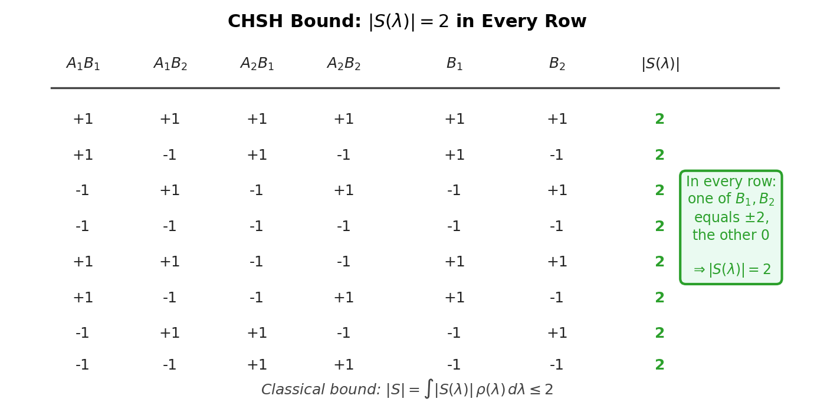
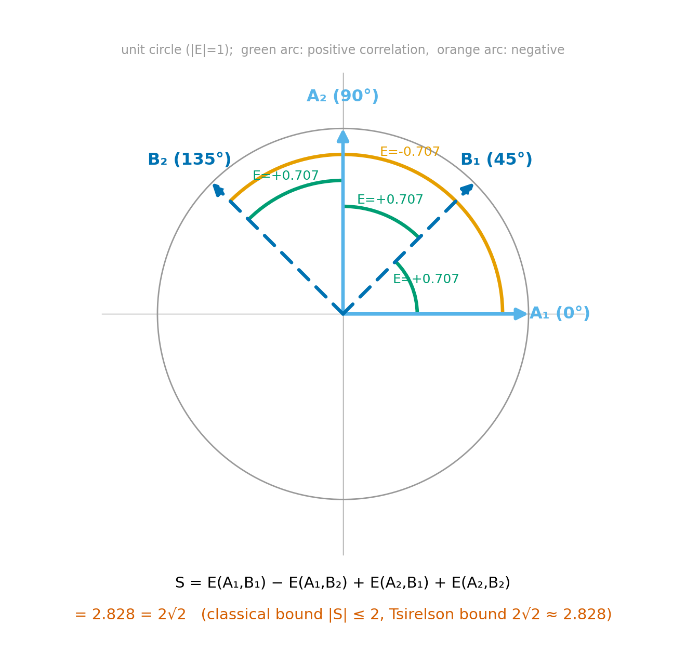
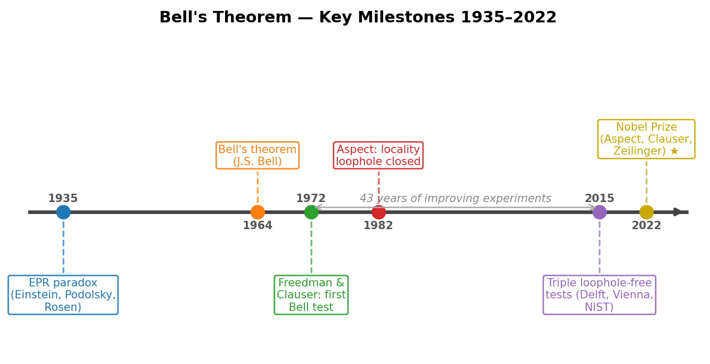

# Chapter 3 — Bell's Theorem and the CHSH Inequality
*A calculation that turned a philosophical dispute into a number — and a number that turned out to be wrong for anyone who believed in hidden instructions.*

For several decades after quantum mechanics was formulated, many physicists believed that correlations between distant particles might work like the correlations between two gloves separated into different boxes: each glove carries a definite handedness from the moment of separation, and opening one box reveals the other's content instantaneously only because the information was already there. Under this view, quantum particles would carry hidden instructions encoding their responses to every possible future measurement, established at the moment of creation.

John Stewart Bell showed in 1964 that this picture makes a testable quantitative prediction. If hidden instructions govern the correlations, then a certain combination of measured correlations — the CHSH parameter — cannot exceed 2. Quantum mechanics predicts $2\sqrt{2}$. That gap is large enough to measure experimentally, and it has since been confirmed by multiple independent experiments that closed every remaining loophole.

This chapter derives that calculation and traces its experimental confirmation.

---

## What Local Realism Claims

Local realism can be stated as two assumptions.

**Realism:** At the moment the two particles are created, each carries a definite pre-determined value for every measurement that could later be performed on it. Call the shared instruction set $\lambda$ — a hidden variable. Alice's outcome for setting $A_i$ is a deterministic function $A_i(\lambda) \in \{+1, -1\}$. Bob's outcome for $B_j$ is $B_j(\lambda) \in \{+1, -1\}$.

**Locality:** Alice's outcome depends only on her setting $A_i$ and the shared $\lambda$, not on what Bob chose to measure or what outcome Bob got. And vice versa.

There is a probability distribution $\rho(\lambda)$ over the instruction sets — we allow full generality here, placing no restrictions on the number of variables or their form. The correlation between Alice's and Bob's outcomes is:

$$E(A_i, B_j) = \int A_i(\lambda)\, B_j(\lambda)\, \rho(\lambda)\, d\lambda.$$

This is the only assumption. Nothing specific about the form of $\lambda$, nothing about how $A_i(\lambda)$ and $B_j(\lambda)$ are computed. Any model consistent with local realism can be written this way.

---

## The CHSH Inequality: Pure Algebra

Clauser, Horne, Shimony, and Holt found the combination of correlations that makes the constraint sharp. Define the **CHSH parameter**:

$$S = E(A_1, B_1) + E(A_1, B_2) + E(A_2, B_1) - E(A_2, B_2).$$

Three terms add; one subtracts. Substituting the local-realistic formula:

$$S = \int \bigl[A_1(\lambda) B_1(\lambda) + A_1(\lambda) B_2(\lambda) + A_2(\lambda) B_1(\lambda) - A_2(\lambda) B_2(\lambda)\bigr] \rho(\lambda)\, d\lambda.$$

Factor the integrand:

$$S(\lambda) \equiv A_1(\lambda)\bigl[B_1(\lambda) + B_2(\lambda)\bigr] + A_2(\lambda)\bigl[B_1(\lambda) - B_2(\lambda)\bigr].$$

Now use one observation: $B_1(\lambda)$ and $B_2(\lambda)$ are each $\pm 1$. In every possible case:

| $B_1$ | $B_2$ | $B_1 + B_2$ | $B_1 - B_2$ |
|-------|-------|-------------|-------------|
| $+1$ | $+1$ | $+2$ | $0$ |
| $+1$ | $-1$ | $0$ | $+2$ |
| $-1$ | $+1$ | $0$ | $-2$ |
| $-1$ | $-1$ | $-2$ | $0$ |

In every row, one factor is $\pm 2$ and the other is $0$. Therefore, for every $\lambda$: one of $|B_1 + B_2|$ and $|B_1 - B_2|$ is 2 and the other is 0. Since $|A_1(\lambda)| = |A_2(\lambda)| = 1$:

$$|S(\lambda)| = 1\cdot 2 + 1\cdot 0 = 2.$$

In every single case, $|S(\lambda)| = 2$ exactly. Averaging over $\lambda$:

$$|S| = \left|\int S(\lambda)\, \rho(\lambda)\, d\lambda\right| \leq \int |S(\lambda)|\, \rho(\lambda)\, d\lambda = 2.$$

$$\boxed{|S| \leq 2.}$$

No choices were made about $\lambda$, about $\rho(\lambda)$, or about the form of $A_i(\lambda)$ and $B_j(\lambda)$. The bound $|S| \leq 2$ is a theorem of arithmetic applied to $\pm 1$ numbers. If the world is locally realistic, $|S|$ cannot exceed 2.

<!-- → [DIAGRAM: four-quadrant table of B₁, B₂ values with the key observation annotated: in every row one column is ±2 and the other is 0, so |S(λ)|=2 exactly — visualizing why the bound is tight rather than loose] -->

*Figure 3.1 — four-quadrant table of B₁, B₂ values with the key observation annotated: in every row one column is ±2 and the other is 0, so |S(λ)|=2…*

---

## What Quantum Mechanics Predicts

We now compute $S$ for the Bell state $|\Phi^+\rangle = \tfrac{1}{\sqrt{2}}(|00\rangle + |11\rangle)$. Alice measures along a direction at angle $\theta_a$ from the $z$-axis; Bob measures at angle $\theta_b$. The two-qubit operator is $(\hat{a}\cdot\vec{\sigma})\otimes(\hat{b}\cdot\vec{\sigma})$.

Using the identity $\langle\Phi^+|(\sigma_i \otimes \sigma_j)|\Phi^+\rangle = \delta_{ij}$ — only matching Pauli indices contribute — the correlation is:

$$E(\hat{a}, \hat{b}) = \cos(\theta_a - \theta_b).$$

The correlation depends only on the relative angle between Alice's and Bob's measurement axes. For the singlet $|\Psi^-\rangle$ the formula is $E = -\cos(\theta_a - \theta_b)$, differing by a sign.

We choose four angles to maximize $S$. Taking partial derivatives of $S$ with respect to all four angles and setting to zero yields equally-spaced solutions; the canonical choice for $|\Phi^+\rangle$ is:

$$\theta_{A_1} = 0°, \quad \theta_{A_2} = 90°, \quad \theta_{B_1} = 45°, \quad \theta_{B_2} = -45°.$$

The four correlations:

$$E(A_1, B_1) = \cos(-45°) = +\frac{1}{\sqrt{2}}, \quad E(A_1, B_2) = \cos(45°) = +\frac{1}{\sqrt{2}},$$
$$E(A_2, B_1) = \cos(45°) = +\frac{1}{\sqrt{2}}, \quad E(A_2, B_2) = \cos(135°) = -\frac{1}{\sqrt{2}}.$$

Therefore:

$$S = \frac{1}{\sqrt{2}} + \frac{1}{\sqrt{2}} + \frac{1}{\sqrt{2}} - \!\left(-\frac{1}{\sqrt{2}}\right) = \frac{4}{\sqrt{2}} = 2\sqrt{2} \approx 2.828.$$

The local-realistic bound is 2. The quantum prediction is $2\sqrt{2}$. The gap, $2\sqrt{2} - 2 \approx 0.828$, is 41% of the classical bound — large enough to measure in any well-equipped optics laboratory.

<!-- → [CHART: "polar wheel" showing Alice's two measurement directions (0°, 90°) and Bob's two (45°, -45°) around a circle, with the four correlations annotated on the connecting arcs, and S = 2√2 displayed; classical bound at 2 shown as a gray ring] -->

*Figure 3.2 — "polar wheel" showing Alice's two measurement directions (0°, 90°) and Bob's two (45°, -45°) around a circle, with the four correlations…*

---

## The Tsirelson Bound

Boris Tsirelson proved in 1980 that quantum mechanics itself imposes a ceiling: for any quantum state and any $\pm 1$-valued observables, $|S| \leq 2\sqrt{2}$.

The argument: for anti-commuting observables $A_1, A_2$ each squaring to the identity, the operator $S^{\text{op}} = A_1 \otimes (B_1 + B_2) + A_2 \otimes (B_1 - B_2)$ satisfies $(S^{\text{op}})^2 \leq 8\,\mathbf{I}$, so its operator norm is at most $2\sqrt{2}$, and no state's expectation value can exceed the operator norm.

This places quantum mechanics in the gap $2 < |S| \leq 2\sqrt{2}$, firmly above the classical bound and firmly below the algebraic maximum of 4. Hypothetical Popescu–Rohrlich boxes — devices that respect no-signaling but produce $|S| = 4$ — are logically conceivable. Pawlowski et al. showed in 2009 that such boxes would violate *information causality*: the principle that $n$ bits of classical communication can convey at most $n$ bits of useful information regardless of shared correlations. This gives a candidate reason why $2\sqrt{2}$ is the ceiling, though information causality must be adopted as an axiom rather than derived from anything more primitive.

---

## The Experimental Program

The gap between 2 and 2.828 is measurable. Before a measurement can rule out all local realistic models, two experimental loopholes must be closed.

**The detection loophole.** If detectors record only a fraction of produced pairs, a local model might arrange for only favorable pairs to be detected, faking a violation. Closing this requires detector efficiency above roughly 82%, so the detected sample is a fair representation of the whole ensemble.

**The locality loophole.** If Alice's measurement outcome can reach Bob's detector before Bob's measurement is complete — via a signal traveling at or below the speed of light — a local model can exploit this. Closing requires: Alice's and Bob's measurement events are spacelike separated; and measurement settings are chosen randomly after the pair is emitted, so no hidden variable in the particles can "know" the future settings at the time of creation.

The experimental history spans fifty years:

**Freedman and Clauser (1972).** First systematic Bell test with photon polarization correlations in an atomic cascade. Found a violation consistent with quantum mechanics — but left both loopholes open.

**Aspect, Dalibard, and Roger (1982).** Switched measurement settings at Orsay while photons were in flight — addressing the locality loophole for the first time. Detection efficiency still insufficient for the detection loophole.

**Hensen et al., Delft (2015).** Electron spins in nitrogen-vacancy centers in diamond, placed 1.3 km apart at opposite ends of the TU Delft campus. Entanglement via photon exchange. The 1.3 km separation ensured spacelike separation of measurement events (locality loophole closed). NV-center spin readout efficiency closed the detection loophole simultaneously. Result: $S = 2.42$, exceeding 2 by more than two standard deviations. *Nature* 526, 682.

**Giustina et al., Vienna (2015).** Entangled photon pairs detected with superconducting nanowire single-photon detectors. Both loopholes closed. Violated the CHSH bound by 11.5 standard deviations. *Physical Review Letters* 115, 250401.

**Shalm et al., NIST (2015).** Independent quantum random-number generators set the measurement angles; entangled photons detected at high efficiency. Both loopholes closed. $p$-value as small as $5.9\times10^{-9}$. *Physical Review Letters* 115, 250402.

Three platforms. Three independent loophole-closing strategies. The same result.

<!-- → [FIGURE: horizontal timeline 1935–2022 with labeled events: EPR (1935), Bell's theorem (1964), Freedman-Clauser (1972), Aspect (1982), triple 2015 experiments (three overlapping points), Nobel Prize (2022, gold star); each event annotated with one-line description] -->

*Figure 3.3 — horizontal timeline 1935–2022 with labeled events: EPR (1935), Bell's theorem (1964), Freedman-Clauser (1972), Aspect (1982), triple 2015…*

In October 2022, the Nobel Committee awarded the Physics Prize to **Alain Aspect, John Clauser, and Anton Zeilinger** "for experiments with entangled photons, establishing the violation of Bell's inequalities and pioneering quantum information science." The citation acknowledged a 60-year arc: from Einstein's 1935 objection, through Bell's 1964 theorem, through Clauser's 1972 experiment, Aspect's 1982 locality-closing refinement, and the 2015 loophole-free confirmation.

Since 2015, the frontier has moved to satellite-based Bell tests. In 2017, Yin et al. distributed entangled photons over 1,200 km between ground stations via the Micius satellite — the largest spacelike separation yet achieved. Device-independent quantum key distribution, where cryptographic security is certified by Bell violation alone without trusting the devices, was demonstrated experimentally by Nadlinger et al. in 2022.

---

## What Bell's Theorem Does and Does Not Say

Bell's theorem rules out local realism. It does not rule out quantum mechanics, which passes every test. It does not prove faster-than-light signaling. And it does not resolve the measurement problem.

**No faster-than-light signaling.** Alice and Bob are spacelike separated. Alice's result is random — she cannot choose it. Bob's reduced density matrix is:

$$\hat{\rho}_B = \mathrm{Tr}_A\bigl(|\Phi^+\rangle\langle\Phi^+|\bigr) = \frac{1}{2}\hat{I}.$$

Alice performing any operation on her qubit — measuring in any basis, applying any unitary, doing nothing at all — leaves Bob's marginal statistics unchanged. The correlation between their outcomes is visible only when they compare notes via a classical channel. Classical channels are bounded by $c$. Entanglement is non-classical, but it is non-signaling.

**A forced interpretational choice.** Bell's theorem forces us to choose which assumption to abandon. Three positions are coherent:

Give up realism: outcomes do not exist before measurement. Standard Copenhagen takes this view. Give up locality: Bohmian mechanics retains definite trajectories but allows non-local influences through the pilot wave. Give up uniqueness of outcomes: many-worlds retains locality and determinism but allows every outcome to occur in different branches.

We cannot retain all three and reproduce quantum predictions. Bell's theorem makes that impossibility precise. Which assumption to jettison is not a question the experiment answers. It is a question each interpreter brings to the experiment.

---

## A Worked Calculation: $S$ for the Singlet

For the singlet $|\Psi^-\rangle = \tfrac{1}{\sqrt{2}}(|01\rangle - |10\rangle)$, the correlation formula is $E(\hat{a}, \hat{b}) = -\cos(\theta_a - \theta_b)$ — opposite sign from $|\Phi^+\rangle$. The sign convention in $S$ matters. With the same four angles $(0°, 90°, 45°, -45°)$ as above and $E = -\cos$:

$$E(A_1, B_1) = -\cos(-45°) = -\frac{1}{\sqrt{2}},\quad E(A_1, B_2) = -\cos(45°) = -\frac{1}{\sqrt{2}},$$
$$E(A_2, B_1) = -\cos(45°) = -\frac{1}{\sqrt{2}},\quad E(A_2, B_2) = -\cos(135°) = +\frac{1}{\sqrt{2}}.$$

$$S = -\frac{1}{\sqrt{2}} - \frac{1}{\sqrt{2}} - \frac{1}{\sqrt{2}} - \frac{1}{\sqrt{2}} = -\frac{4}{\sqrt{2}} = -2\sqrt{2}.$$

So $|S| = 2\sqrt{2}$, the Tsirelson bound. The sign of $S$ depends on the Bell state; the magnitude of the maximum is the same for all four Bell states.

**A common error to avoid.** Suppose everyone measures in the same direction — $\theta_{A_1} = \theta_{A_2} = \theta_{B_1} = \theta_{B_2} = 0°$. For the singlet all four correlations equal $-1$, so $S = -1 - 1 - (-1) - 1 = -2$: exactly at the classical bound, no violation. The violation is a property of the relative angles, not of any single correlation. A large individual correlation (say $E = 1$, perfect correlation) is easily explained by a classical hidden-variable model — it is the combination of four correlations at four different angles that cannot be explained classically.

---

## Open Questions

The Tsirelson bound $|S| \leq 2\sqrt{2}$ sits at a particular position between the local-realistic limit of 2 and the no-signaling maximum of 4. Why exactly there?

Information causality provides a candidate answer: $2\sqrt{2}$ is the unique value consistent with the principle that $n$ classical bits cannot convey more than $n$ bits of information regardless of shared correlations. But information causality is an axiom in that argument, not derived from anything more primitive.

A second observation concerns the Delft experiment (Hensen et al.), which performed 245 trials before publication. The $p$-value was $0.039$ — statistically significant but not overwhelming by the standards of particle physics (which demands $5\sigma$). A subsequent run extended to 2,078 trials and achieved combined $S = 2.38 \pm 0.14$. This illustrates a genuine tension: fully loophole-free experiments with spin qubits produce events slowly (each NV-to-NV entanglement attempt succeeds with low probability), while photon experiments with high statistics still struggle with the detection efficiency threshold.

Bell's theorem forces a choice of which assumption to abandon — locality, realism, or uniqueness of outcomes — but does not specify which. Sixty years of experiment have closed the empirical question. The conceptual question remains in genuinely contested territory.

---

## Exercises

**Warm-up**

1. *[CHSH algebra — the key step]* Write out all four possible assignments of $(B_1, B_2)$. For each, with $A_1 = A_2 = +1$, compute $S(\lambda) = A_1[B_1 + B_2] + A_2[B_1 - B_2]$ and verify $|S(\lambda)| = 2$ in every case. Repeat with $A_1 = +1$, $A_2 = -1$.
*What this tests: internalizing the one arithmetic observation that makes the entire inequality — that for ±1 values, exactly one of* $|B_1+B_2|$ *and* $|B_1-B_2|$ *equals 2 and the other equals 0.*

2. [*Correlation formula for* $|\Phi^+\rangle$] For $|\Phi^+\rangle$ with $\theta_{A_1} = 30°$ and $\theta_{B_1} = 75°$, compute $E(A_1, B_1)$. What is $E$ when Alice and Bob measure in the same direction? In anti-parallel directions?
*What this tests: applying the quantum correlation formula and identifying its extreme values.*

3. *[CHSH at suboptimal angles]* For $|\Phi^+\rangle$ with $\theta_{A_1} = 0°$, $\theta_{A_2} = 60°$, $\theta_{B_1} = 30°$, $\theta_{B_2} = 90°$: compute all four $E(A_i, B_j)$ and evaluate $S$. Is this optimal? Does it violate the classical bound?
*What this tests: working through a non-optimal angle choice to see that violation is real but sensitive to angle selection.*

**Application**

4. *[No-signaling]* Alice and Bob share $|\Phi^+\rangle$. Alice applies the Pauli $X$ gate to her qubit and measures in the $z$-basis. (a) What is the two-qubit state after Alice applies $X$? (b) Compute Bob's reduced density matrix $\hat{\rho}_B = \mathrm{Tr}_A(\rho_{AB})$ before and after Alice's operation. (c) Does Alice's operation change Bob's local statistics?
*What this tests: demonstrating the no-signaling property by explicit density-matrix computation.*

5. *[Product states and local realism]* For the product state $|+\rangle\otimes|+\rangle$, show that the expectation value of $(\hat{a}\cdot\vec{\sigma})\otimes(\hat{b}\cdot\vec{\sigma})$ factorizes as $\langle\hat{a}\cdot\vec{\sigma}\rangle\langle\hat{b}\cdot\vec{\sigma}\rangle$. Use this to argue that no product state can violate the CHSH inequality.
*What this tests: connecting the factorization of a product state to the hidden-variable structure — a product state already "is" a local model.*

6. *[Bell state preparation]* Starting from $|00\rangle$, $|01\rangle$, $|10\rangle$, $|11\rangle$, apply $H\otimes I$ followed by CNOT(control=0, target=1). Identify which Bell state is produced in each case and write the pattern.
*What this tests: circuit-level manipulation of Bell states; connecting gate operations to the entangled states that appear throughout this chapter.*

**Synthesis**

7. *[Experimental critique]* You are designing a Bell-test experiment with entangled photons. Your detectors have efficiency $\eta = 0.75$ (75%). Your data appear to show $S = 2.3$. Write a one-paragraph critique as if you are a skeptical local realist: which loophole applies, and what minimum efficiency would close it?
*What this tests: connecting the loophole structure to the experimental numbers; understanding what "fair sampling" requires.*

8. *[Information causality]* State, in your own words, what a Popescu–Rohrlich box would do, why it does not violate no-signaling, and why Pawlowski et al. argue it is still physically unreasonable. What does this suggest about the status of information causality as a physical principle — is it a theorem or an axiom?
*What this tests: engaging with the open question of why quantum correlations stop at* $2\sqrt{2}$ *rather than at the no-signaling limit.*

**Challenge**

9. *[Tsirelson bound — operator algebra]* For two-qubit operators with $A_1^2 = A_2^2 = B_1^2 = B_2^2 = I$ and $\{A_1, A_2\} = \{B_1, B_2\} = 0$ (anti-commuting on each side): (a) write the operator $S^{\text{op}} = A_1\otimes(B_1 + B_2) + A_2\otimes(B_1 - B_2)$ and compute $(S^{\text{op}})^2$ explicitly; (b) show $(S^{\text{op}})^2 \leq 8\,\mathbf{I}$, so the operator norm $\|S^{\text{op}}\| \leq 2\sqrt{2}$; (c) find a state and operators that saturate this bound and verify $\langle S^{\text{op}}\rangle = 2\sqrt{2}$.
*What this tests: the operator-algebraic proof of the Tsirelson bound — moving beyond the correlation formula to the underlying operator structure.*

---

## References

Bell, J. S. (1964). On the Einstein–Podolsky–Rosen paradox. *Physics*, 1, 195–200.

Clauser, J. F., Horne, M. A., Shimony, A., & Holt, R. A. (1969). Proposed experiment to test local hidden-variable theories. *Physical Review Letters*, 23, 880–884.

Freedman, S. J., & Clauser, J. F. (1972). Experimental test of local hidden-variable theories. *Physical Review Letters*, 28, 938–941.

Aspect, A., Dalibard, J., & Roger, G. (1982). Experimental test of Bell's inequalities using time-varying analyzers. *Physical Review Letters*, 49, 1804–1807.

Tsirelson, B. S. (1980). Quantum generalizations of Bell's inequality. *Letters in Mathematical Physics*, 4, 93–100.

Hensen, B. et al. (2015). Loophole-free Bell inequality violation using electron spins separated by 1.3 kilometres. *Nature*, 526, 682–686.

Giustina, M. et al. (2015). Significant-loophole-free test of Bell's theorem with entangled photons. *Physical Review Letters*, 115, 250401.

Shalm, L. K. et al. (2015). Strong loophole-free test of local realism. *Physical Review Letters*, 115, 250402.

Pawlowski, M. et al. (2009). Information causality as a physical principle. *Nature*, 461, 1101–1104.

Yin, J. et al. (2017). Satellite-based entanglement distribution over 1200 kilometers. *Science*, 356, 1140–1144.

Nadlinger, D. P. et al. (2022). Experimental quantum key distribution certified by Bell's theorem. *Nature*, 607, 682–686.

Larsson, J.-Å. (2014). Loopholes in Bell inequality tests of local realism. *Journal of Physics A*, 47, 424003.

Nobel Committee for Physics (2022). Scientific Background: Entangled States — from Theory to Technology. nobelprize.org/prizes/physics/2022.

