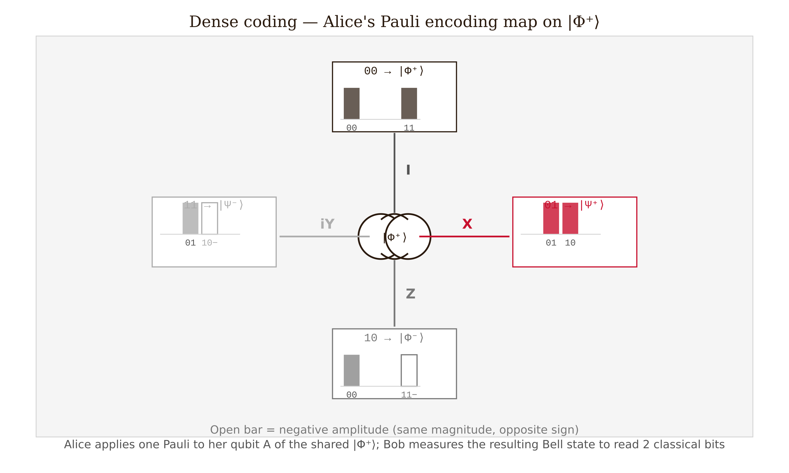

# Chapter 5 — Quantum Teleportation and Dense Coding
*How the same entanglement that forbids copying makes movement possible.*

We established in Chapter 4 that quantum states cannot be copied. This is not a limitation of present technology — it is a theorem, and the proof uses only the mathematics of unitarity. The same entanglement resource that enforces this impossibility turns out to be exactly what is needed to move an unknown quantum state from one place to another. The impossibility and the protocol are not in conflict. They are two consequences of the same underlying structure.

In 1993, Charles Bennett and five collaborators — Brassard, Crépeau, Jozsa, Peres, and Wootters — published a protocol that achieves this: given one shared Bell pair and a classical phone call, Alice can deliver Bob an exact copy of any qubit state she holds, without Alice ever learning anything about the state, and without the original surviving in Alice's hands. [verify: Bennett et al., Phys. Rev. Lett. 70, 1895 (1993)] They called it teleportation. The physics is straightforward to follow: the state crosses no spatial gap. The entanglement was already there. What travels at the speed of light is two classical bits.

---

## Why You Cannot Copy

Before describing the protocol, we review the constraint it operates within. If copying were possible, teleportation would be unnecessary and faster-than-light signaling would be straightforward. So we first ask: why can't we copy?

Suppose a universal quantum cloner exists — a unitary $\hat{U}$ such that, for any normalized qubit state $|\psi\rangle$ and a fixed blank state $|s\rangle$:

$$\hat{U}|\psi\rangle|s\rangle = |\psi\rangle|\psi\rangle.$$

Apply this to two different states $|\psi\rangle$ and $|\phi\rangle$:

$$\hat{U}|\psi\rangle|s\rangle = |\psi\rangle|\psi\rangle, \qquad \hat{U}|\phi\rangle|s\rangle = |\phi\rangle|\phi\rangle.$$

Unitaries preserve inner products. Take the inner product of the input sides and the output sides separately:

$$\langle\psi|\phi\rangle\underbrace{\langle s|s\rangle}_{=1} = \langle\psi|\phi\rangle \quad\text{(inputs)}, \qquad \langle\psi|\phi\rangle^2 \quad\text{(outputs).}$$

Unitarity demands these equal: $\langle\psi|\phi\rangle = \langle\psi|\phi\rangle^2$. A complex number equal to its own square must be 0 or 1. So $|\psi\rangle$ and $|\phi\rangle$ are either orthogonal or identical. Since most pairs of states are neither, no universal cloner exists.

This is the **no-cloning theorem** (Wootters and Zurek, 1982; Dieks, 1982, independently). [verify] The proof used only that $\hat{U}$ is unitary and linear — nothing else about physics. Orthogonal states *can* be copied — a CNOT fan-out copies $|0\rangle$ and $|1\rangle$ exactly — but an unknown superposition cannot. Quantum key distribution is secure because an eavesdropper who intercepts a qubit cannot make a silent copy and pass the original along undisturbed. And, as we will see below, if Bob could clone his received qubit after teleportation, he could statistically distinguish Alice's measurement bases without waiting for her classical phone call, which would allow superluminal signaling.

---

## The Teleportation Protocol

**The setup.** Alice holds qubit $S$ in an unknown state:

$$|\psi\rangle_S = \alpha|0\rangle + \beta|1\rangle,$$

where $\alpha$ and $\beta$ are unknown complex amplitudes. She does not know them — a third party handed her the qubit. She wants Bob to end up with exactly this state, with no quantum channel between them. What they do have is a classical telephone and a pre-shared Bell pair.

**The resource.** Alice and Bob distributed the pair

$$|\Phi^+\rangle_{AB} = \frac{1}{\sqrt{2}}\bigl(|00\rangle + |11\rangle\bigr)_{AB}$$

at some earlier time. Qubit $A$ belongs to Alice; qubit $B$ belongs to Bob. The three-qubit initial state is:

$$|\Psi_0\rangle = |\psi\rangle_S \otimes |\Phi^+\rangle_{AB} = \frac{1}{\sqrt{2}}\bigl(\alpha|000\rangle + \alpha|011\rangle + \beta|100\rangle + \beta|111\rangle\bigr)_{SAB}.$$

Alice holds $S$ and $A$. Bob holds $B$.

**Step 1: Alice applies CNOT (**$S$ **control,** $A$ **target).** The CNOT maps $|x\rangle|y\rangle \mapsto |x\rangle|x\oplus y\rangle$:

$$|\Psi_1\rangle = \frac{1}{\sqrt{2}}\bigl(\alpha|000\rangle + \alpha|011\rangle + \beta|110\rangle + \beta|101\rangle\bigr).$$

**Step 2: Alice applies Hadamard to** $S$. Using $H|0\rangle = (|0\rangle+|1\rangle)/\sqrt{2}$ and $H|1\rangle = (|0\rangle-|1\rangle)/\sqrt{2}$, expanding and collecting by $|m_1 m_2\rangle_{SA}$:

$$|\Psi_2\rangle = \frac{1}{2}\Bigl[|00\rangle_{SA}(\alpha|0\rangle+\beta|1\rangle)_B + |01\rangle_{SA}(\beta|0\rangle+\alpha|1\rangle)_B$$

$$+ |10\rangle_{SA}(\alpha|0\rangle-\beta|1\rangle)_B + |11\rangle_{SA}(-\beta|0\rangle+\alpha|1\rangle)_B\Bigr].$$

The state has been sorted by Alice's two-qubit measurement basis. Each of the four terms shows Bob's conditional state, and each is a simple transformation of the target $|\psi\rangle = \alpha|0\rangle + \beta|1\rangle$:

| Alice's outcome | Probability | Bob's conditional state | Correction |
|:---------------:|:-----------:|:-----------------------:|:----------:|
| $|00\rangle$ | $1/4$ | $\alpha|0\rangle+\beta|1\rangle = |\psi\rangle$ | $I$ |
| $|01\rangle$ | $1/4$ | $\beta|0\rangle+\alpha|1\rangle = X|\psi\rangle$ | $X$ |
| $|10\rangle$ | $1/4$ | $\alpha|0\rangle-\beta|1\rangle = Z|\psi\rangle$ | $Z$ |
| $|11\rangle$ | $1/4$ | $-\beta|0\rangle+\alpha|1\rangle = ZX|\psi\rangle$ | $ZX$ |

**Step 3: Alice measures her two qubits** in the computational basis. She gets one of four outcomes, each with probability $1/4$. Her qubit $S$ collapses to a definite basis state — not to $|\psi\rangle$. The state information has left $S$.

**Step 4: Alice calls Bob.** She sends her two-bit outcome over the classical channel.

**Step 5: Bob applies the correction.** He applies $I$, $X$, $Z$, or $ZX$ to qubit $B$ as given by the table. In every case, his qubit becomes exactly $|\psi\rangle$.

The state has been teleported. Alice no longer has it. Bob does. No copy was made. The original was consumed in the measurement.

<!-- → [FIGURE: circuit diagram for teleportation — three horizontal wires labeled S (Alice), A (Alice), B (Bob); CNOT gate with S control and A target, then H gate on S, then measurement boxes on both S and A; dashed vertical lines (classical channel) from S and A down to correction gates on B; the correction gate label shows I/X/Z/ZX; the initial Bell pair |Φ+⟩ on wires A and B is shown with a wavy line; the unknown state |ψ⟩ enters on wire S] -->

*Figure 5.1 — circuit diagram for teleportation — three horizontal wires labeled S (Alice), A (Alice), B (Bob)*

---

## Why It Does Not Violate No-Cloning or Causality

After Alice's measurement, qubit $S$ is in a definite computational basis state — either $|0\rangle$ or $|1\rangle$ — not in $|\psi\rangle$. The original state has been transferred to Bob; Alice never retained it. At the end, there is exactly one copy of $|\psi\rangle$, now on Bob's qubit. No-cloning is satisfied by construction. More than that: no-cloning *requires* that Alice's qubit be destroyed. If the protocol left $|\psi\rangle$ intact in Alice's hands while Bob also received it, that would be a direct violation.

Before Alice's classical bits arrive, Bob's reduced density matrix is:

$$\hat\rho_B = \text{Tr}_{SA}(|\Psi_2\rangle\langle\Psi_2|) = \frac{\hat{I}}{2}.$$

The maximally mixed state. Whatever Alice measured, whatever $\alpha$ and $\beta$ are, Bob sees the same thing: complete ignorance. There is no information in his qubit until the two classical bits arrive. Those bits travel at or below the speed of light. Teleportation is as fast as a phone call, not faster.

The two classical bits are not a formality. They are the protocol. Without them, the entanglement resource is consumed and Bob has nothing.

It is worth understanding why the reduced density matrix is $\hat{I}/2$ regardless of $|\psi\rangle$. Look at $|\Psi_2\rangle$: it is a sum of four terms, each with weight $1/4$, containing Bob's states $|\psi\rangle$, $X|\psi\rangle$, $Z|\psi\rangle$, and $ZX|\psi\rangle$. The mixed state formed by averaging over these four states — which is what the partial trace computes — equals $\hat{I}/2$ for any $|\psi\rangle$, because $\{I, X, Z, XZ\}$ forms a 1-design on the Bloch sphere: averaging over these four transformations maps any state to the center. The symmetry of the protocol over all outcomes is what prevents information from flowing faster than light.

*Figure 5.5 — Bob's reduced state before the classical bits arrive: any single-qubit state ψ (left) has coherences and a surface Bloch vector, but tracing over Alice's qubits collapses Bob's state to ρ_B = I/2 (right), the maximally mixed state with no off-diagonal elements and Bloch vector at the center — confirming no information about ψ reaches Bob before the phone call.*

---

## Superdense Coding: The Dual Protocol

Teleportation converts one Bell pair plus two classical bits into the transmission of one qubit. Superdense coding is the exact reverse: convert one Bell pair plus one qubit channel into the transmission of two classical bits.

**The setup.** Alice and Bob share $|\Phi^+\rangle_{AB}$ as before. Alice wants to send one of four two-bit messages.

**The encoding.** Alice applies a Pauli gate to her qubit $A$ alone:

| Message | Gate Alice applies | Bell state produced |
|:-------:|:-----------------:|:-------------------:|
| $00$ | $I$ | $|\Phi^+\rangle = (|00\rangle+|11\rangle)/\sqrt{2}$ |
| $01$ | $X$ | $|\Psi^+\rangle = (|01\rangle+|10\rangle)/\sqrt{2}$ |
| $10$ | $Z$ | $|\Phi^-\rangle = (|00\rangle-|11\rangle)/\sqrt{2}$ |
| $11$ | $iY$ | $|\Psi^-\rangle = (|01\rangle-|10\rangle)/\sqrt{2}$ |

Each Pauli rotation on Alice's single qubit steers the shared pair into a different Bell state. This is possible because Alice holds half of an entangled pair: a local rotation on her half has a nonlocal effect on the joint state.

**The transmission.** Alice sends her qubit $A$ to Bob over the quantum channel.

**The decoding.** Bob holds both qubits and performs a Bell measurement: CNOT (A control, B target), then H on qubit A, then measure both in the computational basis. This is exactly the reverse of Bell-state preparation, and it maps each Bell state back to the corresponding computational basis state: $|\Phi^+\rangle \to |00\rangle$, $|\Psi^+\rangle \to |01\rangle$, $|\Phi^-\rangle \to |10\rangle$, $|\Psi^-\rangle \to |11\rangle$.

Bob reads off Alice's two-bit message with certainty.

*Figure 5.3 — Dense coding encoding map: Alice steers the shared Bell pair into one of four orthogonal Bell states by applying a single Pauli gate to her half; each spoke corresponds to one two-bit message, and the bar charts inside each node show which basis amplitudes are nonzero in the resulting Bell state.*

**The duality.**

$$\text{Teleportation: } 1\text{ ebit} + 2\text{ cbits} \;\longrightarrow\; \text{transmit } 1\text{ qubit}.$$
$$\text{Dense coding: } 1\text{ ebit} + 1\text{ qubit channel} \;\longrightarrow\; \text{transmit } 2\text{ cbits}.$$

The entanglement resource is identical. The direction of the resource expenditure is reversed. Without pre-shared entanglement, one qubit can carry at most one classical bit (Holevo's theorem). Entanglement doubles the classical capacity. It does not create something from nothing — the Bell pair is the resource being spent.

*Figure 5.4 — Teleportation–dense coding duality: the same ebit resource (purple) appears in both protocols, but what is input in one protocol is output in the other; two classical bits and a qubit channel swap roles between the two rows.*

<!-- → [FIGURE: side-by-side comparison of teleportation and dense coding — left panel shows teleportation circuit with resource accounting (1 ebit + 2 cbits → 1 qubit transmitted); right panel shows dense coding circuit with resource accounting (1 ebit + 1 qubit channel → 2 cbits transmitted); shared feature: the Bell pair |Φ+⟩ appears in both, emphasizing the same resource used in opposite directions] -->

*Figure 5.2 — side-by-side comparison of teleportation and dense coding — left panel shows teleportation circuit with resource accounting (1 ebit + 2…*

---

## Worked Example: All Four Teleportation Outcomes

Starting from $|\psi\rangle = \alpha|0\rangle + \beta|1\rangle$ and $|\Phi^+\rangle_{AB}$, after Alice's CNOT and Hadamard the state is $|\Psi_2\rangle$ as computed above.

**Outcome** $|00\rangle$. Bob's conditional state: $\alpha|0\rangle+\beta|1\rangle$. Apply $I$. Result: $\alpha|0\rangle+\beta|1\rangle = |\psi\rangle$. ✓

**Outcome** $|01\rangle$. Bob's conditional state: $\beta|0\rangle+\alpha|1\rangle = X|\psi\rangle$. Apply $X$:
$$X(\beta|0\rangle+\alpha|1\rangle) = \beta|1\rangle+\alpha|0\rangle = \alpha|0\rangle+\beta|1\rangle = |\psi\rangle. \checkmark$$

**Outcome** $|10\rangle$. Bob's conditional state: $\alpha|0\rangle-\beta|1\rangle = Z|\psi\rangle$. Apply $Z$:
$$Z(\alpha|0\rangle-\beta|1\rangle) = \alpha|0\rangle+\beta|1\rangle = |\psi\rangle. \checkmark$$

**Outcome** $|11\rangle$. Bob's conditional state: $-\beta|0\rangle+\alpha|1\rangle$. Apply $ZX$ (X first, then Z):
$$X(-\beta|0\rangle+\alpha|1\rangle) = -\beta|1\rangle+\alpha|0\rangle = \alpha|0\rangle-\beta|1\rangle;$$
$$Z(\alpha|0\rangle-\beta|1\rangle) = \alpha|0\rangle+\beta|1\rangle = |\psi\rangle. \checkmark$$

In every case, Bob recovers $|\psi\rangle$ exactly. The correction is deterministic — it depends only on Alice's two classical bits, not on $\alpha$ or $\beta$. Neither party ever learns the values of $\alpha$ and $\beta$. The state information is transferred intact without being read.

The limit of the protocol: it assumes a perfect Bell pair. Real experiments use Bell pairs with fidelity $F < 1$ due to decoherence. If the pair degrades before Alice completes her measurement, Bob receives a mixed state with teleportation fidelity below 1. The connection to the CHSH parameter from Chapter 4 is direct: a Bell pair achieving $S = 2\sqrt{2}$ gives perfect teleportation fidelity; one degraded to $S = 2$ (the CHSH classical bound) still teleports well — $F_\text{tel}(2) = (1 + 1/\sqrt2)/2 \approx 0.85$, comfortably above the best classical protocol's $F = 2/3$. Teleportation stops beating the classical protocol only below $S = 2\sqrt2/3 \approx 0.94$, so a state can be CHSH-local ($S \leq 2$) yet still a useful teleportation resource. The CHSH test on the hardware tells you how good your teleportation resource is.

---

## Exercises

**Warm-up**

1. *Difficulty: Warm-up — tests the no-cloning proof on specific states.*
   Apply the no-cloning argument to $|\psi\rangle = |{+}\rangle = (|0\rangle+|1\rangle)/\sqrt{2}$ and $|\phi\rangle = |0\rangle$. Compute $\langle\phi|\psi\rangle$ explicitly and verify that it equals neither 0 nor 1, confirming that a universal cloner cannot copy these two states simultaneously. Then state in one sentence what goes wrong with the inner-product equation $\langle\psi|\phi\rangle = \langle\psi|\phi\rangle^2$ for this pair.
   *Tests: executing the no-cloning proof for specific states; identifying the step where the contradiction arises.*

2. *Difficulty: Warm-up — tests the superdense encoding table.*
   Starting from $|\Phi^+\rangle = (|00\rangle+|11\rangle)/\sqrt{2}$, apply $Z$ to qubit $A$ and show step by step that the result is $|\Phi^-\rangle = (|00\rangle-|11\rangle)/\sqrt{2}$. Explain in one sentence why this corresponds to Alice encoding the message "10," and why Bob can decode it with certainty.
   *Tests: applying a single-qubit gate to half of an entangled pair; connecting the Bell-state transformation to the encoding table.*

3. *Difficulty: Warm-up — tests no-signaling via the reduced density matrix.*
   Compute Bob's reduced density matrix $\hat\rho_B = \text{Tr}_{SA}(|\Psi_2\rangle\langle\Psi_2|)$ for the state after Alice's CNOT and Hadamard but before her measurement. Show $\hat\rho_B = \hat{I}/2$, confirming that Bob's local statistics contain no information about $\alpha$ and $\beta$ before the classical communication.
   *Tests: partial trace computation; the no-signaling argument via* $\hat I/2$.

**Application**

4. *Difficulty: Application — tracing the protocol for a specific state.*
   Trace the teleportation protocol for $|\psi\rangle = |{+}\rangle = (|0\rangle+|1\rangle)/\sqrt{2}$. For each of the four measurement outcomes, write out Bob's conditional state after Alice's measurement, apply the correction, and verify you recover $|{+}\rangle$.
   *Tests: full protocol trace with an explicit state; all four correction cases.*

5. *Difficulty: Application — superdense coding decode.*
   Alice sends the message "11" using dense coding. She applies $iY$ to her qubit of $|\Phi^+\rangle_{AB}$. (a) Write the resulting two-qubit state. (b) Bob applies CNOT (A control, B target) then H on qubit A; write the state after each operation. (c) Bob measures; what outcome does he get? Verify this matches Alice's message.
   *Tests: complete encode-decode cycle for the* $|\Psi^-\rangle$ *case; Bob's Bell measurement reverses Bell-state preparation.*

6. *Difficulty: Application — resource accounting and failure modes.*
   (a) Explain why Alice cannot reuse the same Bell pair to teleport a second qubit without distributing a fresh entangled pair. (b) If Alice and Bob share two Bell pairs and Alice wants to teleport two independent qubits simultaneously, how many classical bits must she send? (c) What does Bob receive if the shared Bell pair is replaced by the product state $|00\rangle_{AB}$ (no entanglement) — that is, what state does Bob's qubit end up in after he applies his correction?
   *Tests: understanding that entanglement is consumed; scaling the protocol; identifying the classical fallback.*

**Synthesis**

7. *Difficulty: Synthesis — reconstructing the protocol from requirements.*
   You are given one pre-shared Bell pair, a quantum channel (one qubit), and a classical channel (unlimited bits). Write the teleportation protocol from scratch: a labeled gate sequence, the four-outcome correction table, and a one-paragraph argument for why the classical channel cannot be eliminated without violating causality or no-cloning.
   *Tests: producing the protocol from first principles; the causality and no-cloning arguments as constraints.*

8. *Difficulty: Synthesis — teleportation fidelity and the CHSH connection.*
   A Bell pair $|\rho_{AB}\rangle$ with CHSH parameter $S$ can teleport a qubit with fidelity $F_\text{tel} = (1 + S/2\sqrt{2})/2$. (a) Verify that $S = 2\sqrt{2}$ gives $F_\text{tel} = 1$ and $S = 2$ (CHSH classical bound) gives $F_\text{tel} = (1+1/\sqrt2)/2 \approx 0.854$. (b) The best classical protocol (no entanglement) achieves $F = 2/3$. At what $S$ does teleportation fail to beat the classical protocol? (Answer: $S = 2\sqrt2/3 \approx 0.943$ — note this is *below* the CHSH bound, so a CHSH-local state can still beat classical teleportation.) (c) In the Hensen et al. (2015) loophole-free Bell experiment, $S = 2.42\pm0.20$. What teleportation fidelity does this correspond to, and does it beat the classical threshold?
   *Tests: connecting CHSH violation to teleportation fidelity; identifying the classical threshold; applying to real experimental numbers.*

**Challenge**

9. *Difficulty: Challenge — proving no-cloning implies no-signaling.*
   Suppose FTL signaling were possible: Alice, upon measuring her two qubits in Step 3, could instantaneously update Bob's qubit to $|\psi\rangle$ without the classical phone call. (a) Show that in this scenario, Bob could distinguish the measurement basis Alice chose without the classical bits. Specifically: if Alice chose to measure in the $\{|0\rangle, |1\rangle\}$ basis versus the $\{|{+}\rangle, |{-}\rangle\}$ basis, and if Bob could clone his received qubit, describe the experiment Bob could run to determine Alice's choice. (b) Use the no-cloning theorem to show why this experiment fails — what prevents Bob from gathering enough statistics? (c) Therefore, assuming no-cloning, does the collapse of the entangled state in Step 3 carry any usable information to Bob before the classical bits arrive? Argue from the $\hat\rho_B = \hat{I}/2$ result.
   *Tests: the logical chain from FTL → cloning → contradiction; no-cloning as the enforcer of no-signaling; reduced density matrix as the formal statement.*

---

## References

Bennett, C. H., Brassard, G., Crépeau, C., Jozsa, R., Peres, A., & Wootters, W. K. (1993). Teleporting an unknown quantum state via dual classical and Einstein-Podolsky-Rosen channels. *Physical Review Letters*, 70, 1895.

Bennett, C. H., & Wiesner, S. J. (1992). Communication via one- and two-particle operators on Einstein-Podolsky-Rosen states. *Physical Review Letters*, 69, 2881.

Wootters, W. K., & Zurek, W. H. (1982). A single quantum cannot be cloned. *Nature*, 299, 802–803.

Dieks, D. (1982). Communication by EPR devices. *Physics Letters A*, 92, 271–272.

Bouwmeester, D., Pan, J.-W., Mattle, K., Eibl, M., Weinfurter, H., & Zeilinger, A. (1997). Experimental quantum teleportation. *Nature*, 390, 575–579.

Hensen, B. et al. (2015). Loophole-free Bell inequality violation using electron spins separated by 1.3 kilometres. *Nature*, 526, 682–686.

Nielsen, M. A., & Chuang, I. L. (2000). *Quantum Computation and Quantum Information*. Cambridge University Press. §1.3.7, §2.3, §12.1.

Holevo, A. S. (1973). Bounds for the quantity of information transmitted by a quantum communication channel. *Problems of Information Transmission*, 9, 177–183.

