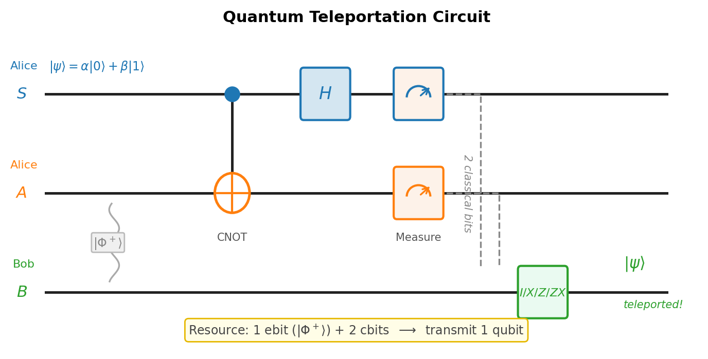
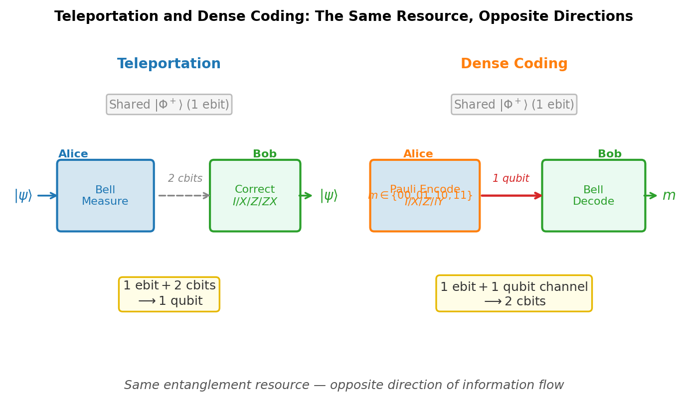

# Chapter 5 — Quantum Teleportation and Dense Coding
*How the same entanglement that forbids copying makes movement possible.*

You cannot photocopy a quantum state. This is not a limitation of present technology — it is structural, a theorem, and the proof fits in three lines of algebra. And yet, the same entanglement that forbids copying turns out to be exactly what you need to move an unknown quantum state from one place to another. The impossibility and the protocol are not in conflict. They are two faces of the same resource.

In 1993, Charles Bennett and five collaborators — Brassard, Crépeau, Jozsa, Peres, and Wootters — published a protocol that achieves this: given one shared Bell pair and a classical phone call, Alice can deliver Bob an exact copy of any qubit state she holds, without Alice ever learning anything about the state, and without the original surviving in Alice's hands. [verify: Bennett et al., Phys. Rev. Lett. 70, 1895 (1993)] They called it teleportation. The name was chosen for its resonance, not for any suggestion of science fiction. The physics is stranger than fiction: the state crosses no spatial gap. The entanglement was already there. What travels at the speed of light is two bits.

---

## Why You Cannot Copy

Before the protocol, the constraint. If copying were possible, teleportation would be unnecessary and faster-than-light signaling would be easy. So the first question is: why can't we copy?

Suppose a universal quantum cloner exists — a unitary $\hat{U}$ such that, for any normalized qubit state $|\psi\rangle$ and a fixed blank state $|s\rangle$:

$$\hat{U}|\psi\rangle|s\rangle = |\psi\rangle|\psi\rangle.$$

Apply this to two different states $|\psi\rangle$ and $|\phi\rangle$:

$$\hat{U}|\psi\rangle|s\rangle = |\psi\rangle|\psi\rangle, \qquad \hat{U}|\phi\rangle|s\rangle = |\phi\rangle|\phi\rangle.$$

Unitaries preserve inner products. Take the inner product of the input sides and the output sides separately:

$$\langle\psi|\phi\rangle\underbrace{\langle s|s\rangle}_{=1} = \langle\psi|\phi\rangle \quad\text{(inputs)}, \qquad \langle\psi|\phi\rangle^2 \quad\text{(outputs).}$$

Unitarity demands these equal: $\langle\psi|\phi\rangle = \langle\psi|\phi\rangle^2$. A complex number equal to its own square must be 0 or 1. So $|\psi\rangle$ and $|\phi\rangle$ are either orthogonal or identical. Since most pairs of states are neither, no universal cloner exists.

This is the **no-cloning theorem** (Wootters and Zurek, 1982; Dieks, 1982, independently). [verify] The proof used only that $\hat{U}$ is unitary and linear — nothing else about physics. Just algebra.

The consequences matter. Orthogonal states *can* be copied — a CNOT fan-out copies $|0\rangle$ and $|1\rangle$ exactly — but an unknown superposition cannot. Quantum key distribution is secure because an eavesdropper who intercepts a qubit cannot make a silent copy and pass the original along undisturbed. And, crucially for what follows, if Bob could clone his received qubit after teleportation, he could statistically distinguish Alice's measurement bases without waiting for her classical phone call, which would allow superluminal signaling. The impossibility of copying is the impossibility of faster-than-light communication.

---

## The Teleportation Protocol

**The setup.** Alice holds qubit $S$ in an unknown state:

$$|\psi\rangle_S = \alpha|0\rangle + \beta|1\rangle,$$

where $\alpha$ and $\beta$ are unknown complex amplitudes. She does not know them — a third party handed her the qubit. She wants Bob to end up with exactly this state, with no quantum channel between them. What they do have is a classical telephone and a pre-shared Bell pair.

**The resource.** Alice and Bob distributed the pair

$$|\Phi^+\rangle_{AB} = \frac{1}{\sqrt{2}}\bigl(|00\rangle + |11\rangle\bigr)_{AB}$$

at some earlier time. Qubit $A$ belongs to Alice; qubit $B$ belongs to Bob. The three-qubit initial state is:

$$|\Psi_0\rangle = |\psi\rangle_S \otimes |\Phi^+\rangle_{AB} = \frac{1}{\sqrt{2}}\bigl(\alpha|000\rangle + \alpha|011\rangle + \beta|100\rangle + \beta|111\rangle\bigr)_{SAB}.$$

Alice holds $S$ and $A$. Bob holds $B$.

**Step 1: Alice applies CNOT ($S$ control, $A$ target).** The CNOT maps $|x\rangle|y\rangle \mapsto |x\rangle|x\oplus y\rangle$:

$$|\Psi_1\rangle = \frac{1}{\sqrt{2}}\bigl(\alpha|000\rangle + \alpha|011\rangle + \beta|110\rangle + \beta|101\rangle\bigr).$$

**Step 2: Alice applies Hadamard to $S$.** Using $H|0\rangle = (|0\rangle+|1\rangle)/\sqrt{2}$ and $H|1\rangle = (|0\rangle-|1\rangle)/\sqrt{2}$, expanding and collecting by $|m_1 m_2\rangle_{SA}$:

$$|\Psi_2\rangle = \frac{1}{2}\Bigl[|00\rangle_{SA}(\alpha|0\rangle+\beta|1\rangle)_B + |01\rangle_{SA}(\beta|0\rangle+\alpha|1\rangle)_B$$

$$+ |10\rangle_{SA}(\alpha|0\rangle-\beta|1\rangle)_B + |11\rangle_{SA}(-\beta|0\rangle+\alpha|1\rangle)_B\Bigr].$$

The state has been sorted by Alice's two-qubit measurement basis. Each of the four terms shows Bob's conditional state, and each is a simple transformation of the target $|\psi\rangle = \alpha|0\rangle + \beta|1\rangle$:

| Alice's outcome | Probability | Bob's conditional state | Correction |
|:---------------:|:-----------:|:-----------------------:|:----------:|
| $|00\rangle$ | $1/4$ | $\alpha|0\rangle+\beta|1\rangle = |\psi\rangle$ | $I$ |
| $|01\rangle$ | $1/4$ | $\beta|0\rangle+\alpha|1\rangle = X|\psi\rangle$ | $X$ |
| $|10\rangle$ | $1/4$ | $\alpha|0\rangle-\beta|1\rangle = Z|\psi\rangle$ | $Z$ |
| $|11\rangle$ | $1/4$ | $-\beta|0\rangle+\alpha|1\rangle = ZX|\psi\rangle$ | $ZX$ |

**Step 3: Alice measures her two qubits** in the computational basis. She gets one of four outcomes, each with probability $1/4$. Her qubit $S$ collapses to a definite basis state — not to $|\psi\rangle$. The state information has left $S$.

**Step 4: Alice calls Bob.** She sends her two-bit outcome over the classical channel.

**Step 5: Bob applies the correction.** He applies $I$, $X$, $Z$, or $ZX$ to qubit $B$ as given by the table. In every case, his qubit becomes exactly $|\psi\rangle$.

The state has been teleported. Alice no longer has it. Bob does. No copy was made. The original was consumed in the measurement.

<!-- → [FIGURE: circuit diagram for teleportation — three horizontal wires labeled S (Alice), A (Alice), B (Bob); CNOT gate with S control and A target, then H gate on S, then measurement boxes on both S and A; dashed vertical lines (classical channel) from S and A down to correction gates on B; the correction gate label shows I/X/Z/ZX; the initial Bell pair |Φ+⟩ on wires A and B is shown with a wavy line; the unknown state |ψ⟩ enters on wire S] -->


*Figure 5.1 — circuit diagram for teleportation — three horizontal wires labeled S (Alice), A (Alice), B (Bob)*

---

## Why It Does Not Violate No-Cloning or Causality

After Alice's measurement, qubit $S$ is in a definite computational basis state — either $|0\rangle$ or $|1\rangle$ — not in $|\psi\rangle$. The original state has been transferred to Bob; Alice never retained it. At the end, there is exactly one copy of $|\psi\rangle$, now on Bob's qubit. No-cloning is satisfied by construction. More than that: no-cloning *requires* that Alice's qubit be destroyed. If the protocol left $|\psi\rangle$ intact in Alice's hands while Bob also received it, that would be a direct violation.

Before Alice's classical bits arrive, Bob's reduced density matrix is:

$$\hat\rho_B = \text{Tr}_{SA}(|\Psi_2\rangle\langle\Psi_2|) = \frac{\hat{I}}{2}.$$

The maximally mixed state. Whatever Alice measured, whatever $\alpha$ and $\beta$ are, Bob sees the same thing: complete ignorance. There is no information in his qubit until the two classical bits arrive. Those bits travel at or below the speed of light. Teleportation is as fast as a phone call, not faster.

The two classical bits are not a formality. They are the protocol. Without them, the entanglement resource is consumed and Bob has nothing.

This is the place to pause and understand why the reduced density matrix is $\hat{I}/2$ regardless of $|\psi\rangle$. Look at $|\Psi_2\rangle$: it is a sum of four terms, each with weight $1/4$, containing Bob's states $|\psi\rangle$, $X|\psi\rangle$, $Z|\psi\rangle$, and $ZX|\psi\rangle$. The mixed state formed by averaging over these four states — which is what the partial trace computes — equals $\hat{I}/2$ for any $|\psi\rangle$, because $\{I, X, Z, XZ\}$ forms a 1-design on the Bloch sphere: averaging over these four transformations maps any state to the center. That is why the no-signaling theorem holds here: the symmetry of the protocol over all outcomes is what prevents information from flowing faster than light.

---

## Superdense Coding: The Dual Protocol

Teleportation converts one Bell pair plus two classical bits into the transmission of one qubit. Superdense coding is the exact reverse: convert one Bell pair plus one qubit channel into the transmission of two classical bits.

**The setup.** Alice and Bob share $|\Phi^+\rangle_{AB}$ as before. Alice wants to send one of four two-bit messages.

**The encoding.** Alice applies a Pauli gate to her qubit $A$ alone:

| Message | Gate Alice applies | Bell state produced |
|:-------:|:-----------------:|:-------------------:|
| $00$ | $I$ | $|\Phi^+\rangle = (|00\rangle+|11\rangle)/\sqrt{2}$ |
| $01$ | $X$ | $|\Psi^+\rangle = (|01\rangle+|10\rangle)/\sqrt{2}$ |
| $10$ | $Z$ | $|\Phi^-\rangle = (|00\rangle-|11\rangle)/\sqrt{2}$ |
| $11$ | $iY$ | $|\Psi^-\rangle = (|01\rangle-|10\rangle)/\sqrt{2}$ |

Each Pauli rotation on Alice's single qubit steers the shared pair into a different Bell state. This is possible because Alice holds half of an entangled pair: a local rotation on her half has a nonlocal effect on the joint state.

**The transmission.** Alice sends her qubit $A$ to Bob over the quantum channel.

**The decoding.** Bob holds both qubits and performs a Bell measurement: CNOT (A control, B target), then H on qubit A, then measure both in the computational basis. This is exactly the reverse of Bell-state preparation, and it maps each Bell state back to the corresponding computational basis state: $|\Phi^+\rangle \to |00\rangle$, $|\Psi^+\rangle \to |01\rangle$, $|\Phi^-\rangle \to |10\rangle$, $|\Psi^-\rangle \to |11\rangle$.

Bob reads off Alice's two-bit message with certainty.

**The duality.**

$$\text{Teleportation: } 1\text{ ebit} + 2\text{ cbits} \;\longrightarrow\; \text{transmit } 1\text{ qubit}.$$
$$\text{Dense coding: } 1\text{ ebit} + 1\text{ qubit channel} \;\longrightarrow\; \text{transmit } 2\text{ cbits}.$$

The entanglement resource is identical. The direction of the resource expenditure is reversed. Without pre-shared entanglement, one qubit can carry at most one classical bit (Holevo's theorem). Entanglement doubles the classical capacity. It does not create something from nothing — the Bell pair is the resource being spent.

<!-- → [FIGURE: side-by-side comparison of teleportation and dense coding — left panel shows teleportation circuit with resource accounting (1 ebit + 2 cbits → 1 qubit transmitted); right panel shows dense coding circuit with resource accounting (1 ebit + 1 qubit channel → 2 cbits transmitted); shared feature: the Bell pair |Φ+⟩ appears in both, emphasizing the same resource used in opposite directions] -->


*Figure 5.2 — side-by-side comparison of teleportation and dense coding — left panel shows teleportation circuit with resource accounting (1 ebit + 2…*

---

## Worked Example: All Four Teleportation Outcomes

Starting from $|\psi\rangle = \alpha|0\rangle + \beta|1\rangle$ and $|\Phi^+\rangle_{AB}$, after Alice's CNOT and Hadamard the state is $|\Psi_2\rangle$ as computed above.

**Outcome $|00\rangle$.** Bob's conditional state: $\alpha|0\rangle+\beta|1\rangle$. Apply $I$. Result: $\alpha|0\rangle+\beta|1\rangle = |\psi\rangle$. ✓

**Outcome $|01\rangle$.** Bob's conditional state: $\beta|0\rangle+\alpha|1\rangle = X|\psi\rangle$. Apply $X$:
$$X(\beta|0\rangle+\alpha|1\rangle) = \beta|1\rangle+\alpha|0\rangle = \alpha|0\rangle+\beta|1\rangle = |\psi\rangle. \checkmark$$

**Outcome $|10\rangle$.** Bob's conditional state: $\alpha|0\rangle-\beta|1\rangle = Z|\psi\rangle$. Apply $Z$:
$$Z(\alpha|0\rangle-\beta|1\rangle) = \alpha|0\rangle+\beta|1\rangle = |\psi\rangle. \checkmark$$

**Outcome $|11\rangle$.** Bob's conditional state: $-\beta|0\rangle+\alpha|1\rangle$. Apply $ZX$ (X first, then Z):
$$X(-\beta|0\rangle+\alpha|1\rangle) = -\beta|1\rangle+\alpha|0\rangle = \alpha|0\rangle-\beta|1\rangle;$$
$$Z(\alpha|0\rangle-\beta|1\rangle) = \alpha|0\rangle+\beta|1\rangle = |\psi\rangle. \checkmark$$

In every case, Bob recovers $|\psi\rangle$ exactly. The correction is deterministic — it depends only on Alice's two classical bits, not on $\alpha$ or $\beta$. Neither party ever learns the values of $\alpha$ and $\beta$. The state information is transferred intact without being read.

The limit of the protocol: it assumes a perfect Bell pair. Real experiments use Bell pairs with fidelity $F < 1$ due to decoherence. If the pair degrades before Alice completes her measurement, Bob receives a mixed state with teleportation fidelity below 1. The connection to the CHSH parameter from Chapter 4 is direct: a Bell pair achieving $S = 2\sqrt{2}$ gives perfect teleportation fidelity; one degraded to $S \leq 2$ (satisfying the classical bound) gives fidelity no better than the best classical protocol, which is $F = 2/3$. Your CHSH test on the hardware tells you how good your teleportation resource is.

---

## Exercises

**Warm-up**

1. *Difficulty: Warm-up — tests the no-cloning proof on specific states.*
   Apply the no-cloning argument to $|\psi\rangle = |{+}\rangle = (|0\rangle+|1\rangle)/\sqrt{2}$ and $|\phi\rangle = |0\rangle$. Compute $\langle\phi|\psi\rangle$ explicitly and verify that it equals neither 0 nor 1, confirming that a universal cloner cannot copy these two states simultaneously. Then state in one sentence what goes wrong with the inner-product equation $\langle\psi|\phi\rangle = \langle\psi|\phi\rangle^2$ for this pair.
   *Tests: executing the no-cloning proof for specific states; identifying the step where the contradiction arises.*

2. *Difficulty: Warm-up — tests the superdense encoding table.*
   Starting from $|\Phi^+\rangle = (|00\rangle+|11\rangle)/\sqrt{2}$, apply $Z$ to qubit $A$ and show step by step that the result is $|\Phi^-\rangle = (|00\rangle-|11\rangle)/\sqrt{2}$. Explain in one sentence why this corresponds to Alice encoding the message "10," and why Bob can decode it with certainty.
   *Tests: applying a single-qubit gate to half of an entangled pair; connecting the Bell-state transformation to the encoding table.*

3. *Difficulty: Warm-up — tests no-signaling via the reduced density matrix.*
   Compute Bob's reduced density matrix $\hat\rho_B = \text{Tr}_{SA}(|\Psi_2\rangle\langle\Psi_2|)$ for the state after Alice's CNOT and Hadamard but before her measurement. Show $\hat\rho_B = \hat{I}/2$, confirming that Bob's local statistics contain no information about $\alpha$ and $\beta$ before the classical communication.
   *Tests: partial trace computation; the no-signaling argument via $\hat I/2$.*

**Application**

4. *Difficulty: Application — tracing the protocol for a specific state.*
   Trace the teleportation protocol for $|\psi\rangle = |{+}\rangle = (|0\rangle+|1\rangle)/\sqrt{2}$. For each of the four measurement outcomes, write out Bob's conditional state after Alice's measurement, apply the correction, and verify you recover $|{+}\rangle$.
   *Tests: full protocol trace with an explicit state; all four correction cases.*

5. *Difficulty: Application — superdense coding decode.*
   Alice sends the message "11" using dense coding. She applies $iY$ to her qubit of $|\Phi^+\rangle_{AB}$. (a) Write the resulting two-qubit state. (b) Bob applies CNOT (A control, B target) then H on qubit A; write the state after each operation. (c) Bob measures; what outcome does he get? Verify this matches Alice's message.
   *Tests: complete encode-decode cycle for the $|\Psi^-\rangle$ case; Bob's Bell measurement reverses Bell-state preparation.*

6. *Difficulty: Application — resource accounting and failure modes.*
   (a) Explain why Alice cannot reuse the same Bell pair to teleport a second qubit without distributing a fresh entangled pair. (b) If Alice and Bob share two Bell pairs and Alice wants to teleport two independent qubits simultaneously, how many classical bits must she send? (c) What does Bob receive if the shared Bell pair is replaced by the product state $|00\rangle_{AB}$ (no entanglement) — that is, what state does Bob's qubit end up in after he applies his correction?
   *Tests: understanding that entanglement is consumed; scaling the protocol; identifying the classical fallback.*

**Synthesis**

7. *Difficulty: Synthesis — reconstructing the protocol from requirements.*
   You are given one pre-shared Bell pair, a quantum channel (one qubit), and a classical channel (unlimited bits). Write the teleportation protocol from scratch: a labeled gate sequence, the four-outcome correction table, and a one-paragraph argument for why the classical channel cannot be eliminated without violating causality or no-cloning.
   *Tests: producing the protocol from first principles; the causality and no-cloning arguments as constraints.*

8. *Difficulty: Synthesis — teleportation fidelity and the CHSH connection.*
   A Bell pair $|\rho_{AB}\rangle$ with CHSH parameter $S$ can teleport a qubit with fidelity $F_\text{tel} = (1 + S/2\sqrt{2})/2$. (a) Verify that $S = 2\sqrt{2}$ gives $F_\text{tel} = 1$ and $S = 2$ (classical bound) gives $F_\text{tel} = 3/4$. (b) The best classical protocol (no entanglement) achieves $F = 2/3$. At what $S$ does teleportation fail to beat the classical protocol? (c) In the Hensen et al. (2015) loophole-free Bell experiment, $S = 2.42\pm0.20$. What teleportation fidelity does this correspond to, and does it beat the classical threshold?
   *Tests: connecting CHSH violation to teleportation fidelity; identifying the classical threshold; applying to real experimental numbers.*

**Challenge**

9. *Difficulty: Challenge — proving no-cloning implies no-signaling.*
   Suppose FTL signaling were possible: Alice, upon measuring her two qubits in Step 3, could instantaneously update Bob's qubit to $|\psi\rangle$ without the classical phone call. (a) Show that in this scenario, Bob could distinguish the measurement basis Alice chose without the classical bits. Specifically: if Alice chose to measure in the $\{|0\rangle, |1\rangle\}$ basis versus the $\{|{+}\rangle, |{-}\rangle\}$ basis, and if Bob could clone his received qubit, describe the experiment Bob could run to determine Alice's choice. (b) Use the no-cloning theorem to show why this experiment fails — what prevents Bob from gathering enough statistics? (c) Therefore, assuming no-cloning, does the collapse of the entangled state in Step 3 carry any usable information to Bob before the classical bits arrive? Argue from the $\hat\rho_B = \hat{I}/2$ result.
   *Tests: the logical chain from FTL → cloning → contradiction; no-cloning as the enforcer of no-signaling; reduced density matrix as the formal statement.*

---

## LLM Exercises

The following exercises are designed to be worked with a large language model as a thinking partner — not to generate the protocol, but to probe reasoning, check algebra, and explore the edges of what the chapter established.

1. Ask an LLM to trace the teleportation protocol for $|\psi\rangle = |1\rangle$, showing the full three-qubit state after each of the five steps and all four correction cases. Check: does the derivation of $|\Psi_2\rangle$ match the general formula with $\alpha = 0$, $\beta = 1$? Do all four correction cases yield $|1\rangle$?

2. Ask an LLM to explain why the four states $\{|\psi\rangle, X|\psi\rangle, Z|\psi\rangle, ZX|\psi\rangle\}$ average to $\hat{I}/2$ for any $|\psi\rangle$. The explanation should connect this to the Pauli group and the fact that $\{I, X, Z, XZ\}$ forms a 1-design on the Bloch sphere. Ask it whether this property is special to the Pauli gates or whether other gate sets would also work.

3. Ask an LLM to explain why superdense coding does not violate the Holevo bound. The explanation should distinguish between the Holevo bound with and without pre-shared entanglement, and state the entanglement-assisted bound explicitly. Ask it to confirm that dense coding saturates the entanglement-assisted bound.

4. Ask an LLM to describe the first experimental demonstration of quantum teleportation (Bouwmeester et al., 1997). Ask it to identify what the experimentalists actually teleported (the polarization state of a photon), how they created their Bell pair, what their measured fidelity was, and what technical limitations prevented perfect fidelity. Evaluate whether the experimental description is physically accurate.

5. Ask an LLM to explain the connection between teleportation and quantum error correction. Specifically: error-correcting codes use entanglement to detect and correct errors on qubits; teleportation uses entanglement to move qubits. Ask it to explain whether a quantum error-correcting code can be seen as a kind of "teleportation through a noisy channel," and what the analogy breaks down on.

---

## References

Bennett, C. H., Brassard, G., Crépeau, C., Jozsa, R., Peres, A., & Wootters, W. K. (1993). Teleporting an unknown quantum state via dual classical and Einstein-Podolsky-Rosen channels. *Physical Review Letters*, 70, 1895.

Bennett, C. H., & Wiesner, S. J. (1992). Communication via one- and two-particle operators on Einstein-Podolsky-Rosen states. *Physical Review Letters*, 69, 2881.

Wootters, W. K., & Zurek, W. H. (1982). A single quantum cannot be cloned. *Nature*, 299, 802–803.

Dieks, D. (1982). Communication by EPR devices. *Physics Letters A*, 92, 271–272.

Bouwmeester, D., Pan, J.-W., Mattle, K., Eibl, M., Weinfurter, H., & Zeilinger, A. (1997). Experimental quantum teleportation. *Nature*, 390, 575–579.

Hensen, B. et al. (2015). Loophole-free Bell inequality violation using electron spins separated by 1.3 kilometres. *Nature*, 526, 682–686.

Nielsen, M. A., & Chuang, I. L. (2000). *Quantum Computation and Quantum Information*. Cambridge University Press. §1.3.7, §2.3, §12.1.

Holevo, A. S. (1973). Bounds for the quantity of information transmitted by a quantum communication channel. *Problems of Information Transmission*, 9, 177–183.

---

## Running Project — Reconstruct a Real Research Result

**This chapter adds:** the *resource-quality bridge* — the map from a Bell pair's CHSH value $S$ to the teleportation fidelity $F_\text{tel} = (1 + S/2\sqrt2)/2$ it can deliver, and the classical threshold $F = 2/3$ a quantum resource must beat. This is the first piece of the **honesty layer**: a paper that reports $S$ is implicitly bounding what its entanglement can *do*, and you can compute that bound. It turns a raw correlation number into a statement about capability — exactly the kind of "what does this actually claim" reasoning Chapter 10 demands.

### Exercise R1 — When to Use AI
**The judgment:** In this chapter's project work, AI assistance is appropriate for:
- Evaluating $F_\text{tel}(S) = (1 + S/2\sqrt2)/2$ and the classical thresholds at given $S$ — *Why AI works here:* one-line arithmetic checked against the endpoints ($S=2\sqrt2\to F=1$, $S=2\to F=3/4$).
- Tracing the four teleportation correction cases on a specific input state — *Why AI works here:* deterministic Pauli algebra you verify by recovering $|\psi\rangle$ in every branch.
**The tell:** You are using AI well when the fidelity formula's endpoints and the $F=2/3$ classical line are available as independent checks.

### Exercise R2 — When NOT to Use AI
**The judgment:** These tasks require your judgment; AI output here can't be trusted without redoing the work:
- Deciding whether your paper's resource *clears the classical threshold* — *Why AI fails here:* it requires propagating the paper's $S$ (with its error bar) through $F_\text{tel}$ and comparing to $2/3$; an LLM will declare "beats classical" without carrying the uncertainty.
- Judging whether teleportation fidelity is even the right capability metric for your paper's claim — *Why AI fails here:* a paper may claim sensing sensitivity or a logical error rate, not fidelity; mapping the claim to the right figure of merit is your call.
**The tell:** If you could not state whether your resource beats $F=2/3$ — and with what margin — without the AI, it did the assessment that should have been yours.
**Physics-judgment connection:** This trains checking a derived capability against a hard classical benchmark ($F=2/3$) and against the formula's limiting cases — turning a correlation into a falsifiable claim about what the hardware can do.

### Exercise R3 — LLM Exercise
**What you're building this chapter:** the capability assessment for your resource — the teleportation fidelity implied by your paper's $S$, with the classical-threshold comparison.
**Tool:** Claude chat.
**The Prompt:**
```
I am assessing what a Bell-test resource can DO, as part of reconstructing a
paper's claim. The paper reports a CHSH parameter S_exp = [PASTE value with error
bar, e.g. 2.42 +/- 0.20].

1. Using F_tel(S) = (1 + S/(2*sqrt(2)))/2, compute the teleportation fidelity for
   S = 2*sqrt(2) and for S = 2, confirming F=1 and F=3/4 respectively.
2. Compute F_tel for S_exp, and also for S_exp + and - its error bar, giving a
   fidelity range.
3. The best classical (no-entanglement) teleportation fidelity is F = 2/3. State
   whether the fidelity range from step 2 lies entirely above 2/3, straddles it,
   or lies below it. Report the margin numerically. Do NOT editorialize about
   whether this "proves" anything — just give the numbers and where they sit
   relative to 2/3.
4. State in one sentence what this resource can and cannot be claimed to do, based
   only on these numbers.
Show the arithmetic, including the error-bar propagation.
```
**What this produces:** $F_\text{tel}$ for your $S_\text{exp}$ with an uncertainty range, the comparison to the classical $2/3$ line, and a tight capability statement — a honesty-layer entry for the dossier.
**How to adapt:** *Your system:* if your paper is QEC or sensing, swap this for the relevant capability metric (logical error rate, sensitivity) — the *structure* (compute capability, compare to classical/physical benchmark, carry the error bar) is identical. *ChatGPT/Gemini:* same prompt. *Claude Project:* append to the dossier's honesty-layer section.
**Builds on:** Chapter 3's $S_\text{exp}$ and Chapter 4's Bell-measurement circuit (used inside teleportation).  **Next:** Chapter 6 derives the decoherence that drives $S$ (and thus $F_\text{tel}$) below the ideal — the *cause* of the resource degradation you just quantified.

### Exercise R4 — CLI Exercise
**What you're building this chapter:** a `capability.py` in your dossier that maps $S$ (with uncertainty) to $F_\text{tel}$ and flags the classical threshold.
**Tool:** Claude Code.
**Skill level:** Intermediate
**Setup — confirm:**
- [ ] `reconstruction-dossier/` with `chsh.py` and `circuit.py` present.
- [ ] Claude Code installed.
- [ ] Add to `CLAUDE.md`: "Capability claims must carry the resource's uncertainty: propagate the error bar through any derived figure of merit and compare to the named classical benchmark (F=2/3 for teleportation)."
**The Task:**
```
In reconstruction-dossier/:

1. Add capability.py with:
   - f_tel(S): return (1 + S/(2*sqrt(2)))/2. Assert f_tel(2*sqrt(2)) == 1 and
     f_tel(2) == 0.75 within 1e-9.
   - assess(S, dS): return f_tel(S) and the interval [f_tel(S-dS), f_tel(S+dS)],
     plus a string "above" / "straddles" / "below" relative to 2/3.
2. __main__: run assess(S_exp, dS_exp) for my paper's reported [PASTE S_exp, dS_exp]
   and print the fidelity, the interval, and the classical-threshold verdict.
3. Append to PROJECT.md a line: "Capability: F_tel = [value] ([interval]),
   classical 2/3 threshold = [above/straddles/below]."
4. Run, paste output. Leave earlier files untouched.

Stop after the endpoints assertion passes and PROJECT.md is updated.
```
**Expected output:** `capability.py`, a console fidelity-with-interval, and a `PROJECT.md` capability line with the classical-threshold verdict.
**What to inspect:** the $F(2\sqrt2)=1$ and $F(2)=0.75$ endpoints hold; the verdict string correctly reflects whether the whole interval clears $2/3$.
**If it goes wrong:** if `f_tel(2)` does not return exactly 0.75, the $2\sqrt2$ normalization in the denominator is wrong (a common $\sqrt2$-vs-$2\sqrt2$ slip) — fix the constant.
**CLAUDE.md / AGENTS.md note:** keep "always propagate the error bar into derived figures of merit; never report a capability as a bare central value."

### Exercise R5 — AI Validation Exercise
**What you're validating:** the R3/R4 capability assessment ($F_\text{tel}$ and its position relative to $2/3$).
**Validation type:** Numerical result + reasoning chain.
**Risk level:** Medium — the temptation is an unhedged "beats classical" claim that ignores an interval straddling $2/3$.
**Setup:** use the R4 output.
**The Validation Task:** Evaluate against this checklist; mark Pass / Fail / Cannot determine with reasoning.
```
Validation Checklist — Quantum Teleportation and Dense Coding
□ Correctness: does F_tel(2*sqrt(2)) = 1 and F_tel(2) = 0.75 exactly?
□ Completeness: did it report an INTERVAL from the error bar, not just a point?
□ Scope: did it compare to the correct classical threshold (2/3), not 3/4?
□ Threshold logic: is the "above/straddles/below 2/3" verdict consistent with the
  reported interval?
□ Honesty: does the one-sentence capability claim avoid overstating (no "proves
  quantum advantage" from a fidelity that merely beats 2/3)?
□ Failure-mode check: any of —
  - fluent but wrong (clean F value, but classical threshold quoted as 3/4)
  - dropped error bar (point estimate above 2/3 while the interval straddles it)
  - confusing the 3/4 entanglement-floor with the 2/3 classical bound
```
**What to do with findings:** pass → record the capability statement in the honesty layer; one fail → fix and re-run; multiple fails → recompute $F_\text{tel}$ by hand at the three $S$ values, it is one formula.
**AI Use Disclosure (mandatory, two sentences):**
> *1:* The AI computed $F_\text{tel}$ from the reported $S$ and its error bar and compared the interval to the classical $2/3$ threshold.
> *2:* The AI could not determine whether teleportation fidelity is the *right* capability metric for my paper's actual claim — that judgment was mine.
**Physics-judgment connection:** This validation trains comparing a derived capability against a hard classical benchmark while carrying the uncertainty — the discipline that separates "the resource is good" from "the resource beats classical by margin X."

---
