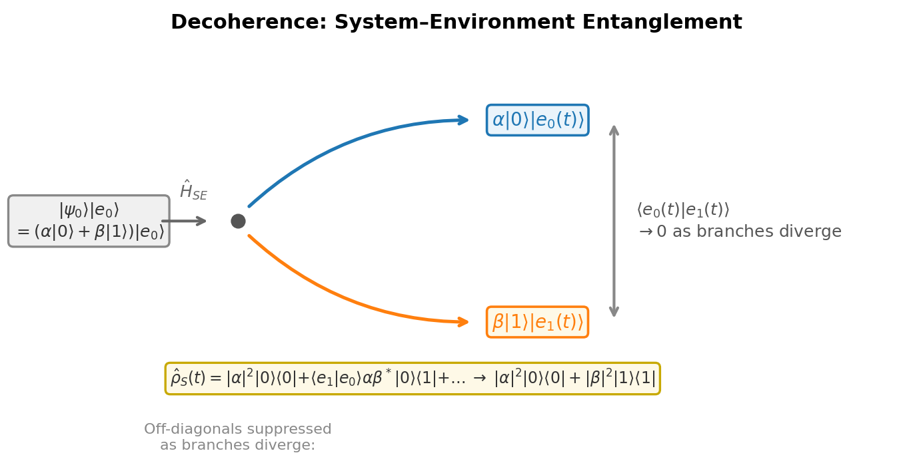
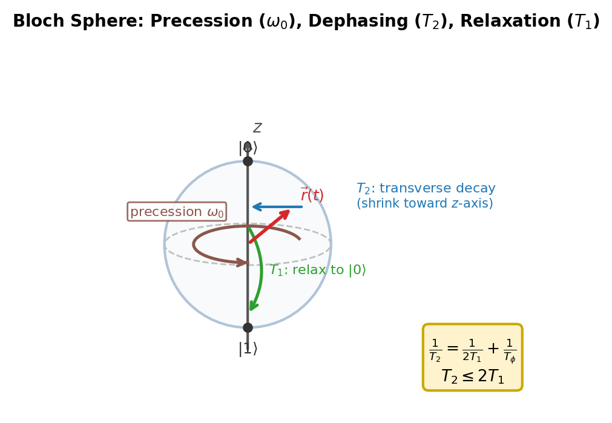

# Chapter 6 — Open Systems: Decoherence and the Lindblad Equation

The symbol $T_2$ appears in nearly every paper on superconducting qubits. It sits in the abstract, next to the processor schematic. By the end of this chapter, we will understand exactly what it means — and be able to derive where the $T_2$ value comes from in the mathematics, what it measures in the density matrix, and why it determines whether a computation succeeds or fails.

$T_2$ is the coherence time. It measures how long the off-diagonal entries of the density matrix survive before they decay to zero. When they reach zero, the qubit has become classical: it is in the ground state or the excited state with some probability, but it is no longer in a quantum superposition. The quantum-to-classical transition is not a philosophical event. It is a number in microseconds, printed in a paper abstract.

To understand $T_2$ we need the equation that governs it. That equation is the Lindblad master equation.

---

## Why Pure States Fail: The System–Environment Split

In every previous chapter, we treated qubits as isolated. The state was pure, evolution was unitary, and that was sufficient. In practice, no qubit is truly isolated. A superconducting transmon couples to substrate phonons, control lines, neighboring qubits, and stray electromagnetic fields. A trapped ion couples to laser phase noise and ambient magnetic fields. A nitrogen-vacancy center in diamond sits in a bath of $^{13}\text{C}$ nuclear spins. These environments are the dominant noise source.

The formal setup: write the full Hamiltonian as:

$$\hat H_\text{total} = \hat H_S \otimes \hat I_E + \hat I_S \otimes \hat H_E + \hat H_{SE}.$$

The total state $|\Psi(t)\rangle$ of system plus environment evolves unitarily — pure state in, pure state out. The environment has $\sim 10^{23}$ degrees of freedom, so we cannot and do not want to track all of them.

The **reduced density matrix** is the solution. We trace out the environment:

$$\hat\rho_S(t) = \text{Tr}_E\bigl(|\Psi(t)\rangle\langle\Psi(t)|\bigr).$$

This object gives correct predictions for any measurement on the system alone. The partial trace is not a coarse-graining or an approximation — it is exact. What is approximate is everything we are about to do to find an equation for $\hat\rho_S(t)$.

**Why the result is mixed.** Suppose at $t = 0$ the system is in a pure state $|\psi_0\rangle$ and the environment is in $|e_0\rangle$, so the total state is unentangled. After a short time, $\hat H_{SE}$ couples them:

$$|\Psi(t)\rangle = \alpha|0\rangle|e_0(t)\rangle + \beta|1\rangle|e_1(t)\rangle,$$

where $|e_0(t)\rangle$ and $|e_1(t)\rangle$ are environment branches that have diverged depending on the system state. The reduced density matrix is:

$$\hat\rho_S(t) = |\alpha|^2|0\rangle\langle 0| + \alpha\beta^*\langle e_1(t)|e_0(t)\rangle|0\rangle\langle 1| + \alpha^*\beta\langle e_0(t)|e_1(t)\rangle|1\rangle\langle 0| + |\beta|^2|1\rangle\langle 1|.$$

The off-diagonal terms are suppressed by the overlap $\langle e_0(t)|e_1(t)\rangle$. As the environment branches become more orthogonal — as the environment "records" which state the qubit was in — this overlap decays toward zero. When $\langle e_0(t)|e_1(t)\rangle = 0$, the density matrix is diagonal: $|\alpha|^2|0\rangle\langle 0| + |\beta|^2|1\rangle\langle 1|$. This is a classical probability distribution. Quantum coherence has leaked into the environment and cannot be retrieved.

<!-- → [FIGURE: branching-world diagram showing the total state splitting — the qubit's |0⟩ branch entangled with one environment trajectory and |1⟩ with another, the overlap ⟨e₀|e₁⟩ labeled on a bracket connecting the two branches, showing it approaches zero as the branches diverge] -->

*Figure 6.1 — branching-world diagram showing the total state splitting — the qubit's |0⟩ branch entangled with one environment trajectory and |1⟩ with…*

---

## The Bloch Representation

For a single qubit, every density matrix can be written in Bloch form:

$$\hat\rho = \frac{1}{2}\bigl(\hat I + \vec r \cdot \vec\sigma\bigr), \qquad \vec r = (r_x, r_y, r_z), \quad |\vec r| \leq 1.$$

Pure states have $|\vec r| = 1$ and sit on the surface of the Bloch sphere. Mixed states have $|\vec r| < 1$ and sit inside. The maximally mixed state $\hat I/2$ has $\vec r = \vec 0$. Explicitly:

$$\hat\rho = \begin{pmatrix} \frac{1+r_z}{2} & \frac{r_x - ir_y}{2} \\[4pt] \frac{r_x + ir_y}{2} & \frac{1-r_z}{2} \end{pmatrix}.$$

The diagonal entries $\rho_{00}$ and $\rho_{11}$ are the populations. The off-diagonal entry $\rho_{01}$ is the coherence — its magnitude measures how quantum the state is. Decoherence shrinks $|\rho_{01}|$ toward zero. Energy relaxation drives $\rho_{11}$ toward zero. Both move the Bloch vector from the surface toward the interior. Energy relaxation additionally pushes it toward the south pole (the ground state $|0\rangle$).

The von Neumann equation for a closed system — $d\hat\rho/dt = -(i/\hbar)[\hat H, \hat\rho]$ — preserves purity. The Bloch vector stays on the sphere surface and precesses, with no dissipation. For an open system this equation is insufficient. The correct equation must satisfy three properties the von Neumann equation alone cannot guarantee: trace preservation ($\text{Tr}(\hat\rho) = 1$ for all time), Hermiticity, and complete positivity.

Complete positivity is the subtlest requirement. Ordinary positivity requires all eigenvalues of $\hat\rho$ to be non-negative. Complete positivity requires that $(\mathcal{E}\otimes\mathcal{I})(\hat\rho_\text{ext}) \geq 0$ for any extension of the system to a larger Hilbert space — because the system may be entangled with a reference that is not subject to the noise. Maps that fail complete positivity can produce negative probabilities on entangled inputs, which is unphysical.

---

## The Lindblad (GKSL) Master Equation

In 1976, Gorini, Kossakowski, and Sudarshan, and independently Lindblad, proved that the most general Markovian, completely positive, trace-preserving master equation has the form:

$$\boxed{\frac{d\hat\rho}{dt} = -\frac{i}{\hbar}[\hat H, \hat\rho] + \sum_k\left(\hat L_k\hat\rho\hat L_k^\dagger - \frac{1}{2}\bigl\{\hat L_k^\dagger\hat L_k, \hat\rho\bigr\}\right).}$$

The first term is Hamiltonian evolution — unitary and reversible. The second is the **dissipator** $\mathcal{D}[\hat\rho]$, summed over noise channels. Each $\hat L_k$ is a **jump operator** encoding one physical decoherence process.

**Trace preservation, explicitly.** Using cyclicity of trace:

$$\text{Tr}\bigl(\hat L_k\hat\rho\hat L_k^\dagger\bigr) - \frac{1}{2}\text{Tr}\bigl(\hat L_k^\dagger\hat L_k\hat\rho\bigr) - \frac{1}{2}\text{Tr}\bigl(\hat\rho\hat L_k^\dagger\hat L_k\bigr) = \text{Tr}\bigl(\hat L_k^\dagger\hat L_k\hat\rho\bigr) - \text{Tr}\bigl(\hat L_k^\dagger\hat L_k\hat\rho\bigr) = 0.$$

So $d\,\text{Tr}(\hat\rho)/dt = 0$: normalization is preserved exactly.

**The Markovian assumption.** The Lindblad equation assumes the bath has no memory — bath correlation functions decay faster than any system timescale. This is the Born–Markov approximation. For most qubit hardware (superconducting transmons in a cold bath, trapped ions with Markovian laser phase noise), it is an excellent approximation. For structured baths — a photonic crystal cavity, a spin bath with long correlations — it breaks down, and non-Markovian extensions are required.

**The GKSL form is not postulated — it is derived.** We start with the full system–bath Hamiltonian, move to the interaction picture, and expand to second order in $\hat H_{SE}$ (Born approximation: weak coupling). We then trace out the bath, apply the Markov approximation (bath correlation time $\tau_B \ll T_1, T_2$), and apply a secular approximation. The result is exactly the GKSL equation, with jump operators and rates determined by the bath spectral density at the system transition frequencies. The key step that forces the anticommutator structure — ensuring complete positivity rather than mere positivity — is the secular approximation applied to a completely positive map.

---

## Deriving the Bloch Equations

We take the qubit Hamiltonian $\hat H = (\hbar\omega_0/2)\hat\sigma_z$ and two jump operators:

**Pure dephasing:** $\hat L_\phi = \sqrt{1/(2T_\phi)}\,\hat\sigma_z$. Random phase kicks from the environment with no energy exchange.

**Energy relaxation:** $\hat L_1 = \sqrt{1/T_1}\,\hat\sigma_- = \sqrt{1/T_1}\,|0\rangle\langle 1|$. The excited state decaying to the ground state by emitting energy.

**The Hamiltonian term.** The commutator $[\hat\sigma_z, \hat\rho]$ acting on the Bloch vector, using $[\hat\sigma_z, \hat\sigma_x] = 2i\hat\sigma_y$ and $[\hat\sigma_z, \hat\sigma_y] = -2i\hat\sigma_x$:

$$\dot r_x^\text{H} = -\omega_0 r_y, \quad \dot r_y^\text{H} = +\omega_0 r_x, \quad \dot r_z^\text{H} = 0.$$

This describes free precession about $\hat z$ at frequency $\omega_0$, with no dissipation.

**The dephasing dissipator.** With $\hat L_\phi = \sqrt{1/2T_\phi}\,\hat\sigma_z$, we compute $\hat\sigma_z\hat\rho\hat\sigma_z - \hat\rho$. Using $\hat\sigma_z\hat\sigma_x\hat\sigma_z = -\hat\sigma_x$ and $\hat\sigma_z\hat\sigma_y\hat\sigma_z = -\hat\sigma_y$, the dissipator eliminates the transverse components and leaves the longitudinal one unchanged:

$$\dot r_x^\phi = -\frac{r_x}{T_\phi}, \qquad \dot r_y^\phi = -\frac{r_y}{T_\phi}, \qquad \dot r_z^\phi = 0.$$

Pure dephasing squeezes the Bloch vector toward the $z$-axis without moving it along it.

**The relaxation dissipator.** Working through $\hat L_1\hat\rho\hat L_1^\dagger - \frac{1}{2}\{\hat L_1^\dagger\hat L_1, \hat\rho\}$ with $\hat\sigma_-\hat\sigma_+ = |0\rangle\langle 0|$ and $\hat\sigma_+\hat\sigma_- = |1\rangle\langle 1|$:

$$\dot r_x^{(1)} = -\frac{r_x}{2T_1}, \qquad \dot r_y^{(1)} = -\frac{r_y}{2T_1}, \qquad \dot r_z^{(1)} = -\frac{r_z + 1}{T_1}.$$

The transverse components decay at *half* the longitudinal rate. This 2:1 ratio is not an approximation — it follows automatically from the Lindblad structure of $\hat\sigma_-$.

**Combining all contributions:**

$$\dot r_x = -\omega_0 r_y - \frac{r_x}{T_2}, \qquad \dot r_y = +\omega_0 r_x - \frac{r_y}{T_2}, \qquad \dot r_z = -\frac{r_z - r_z^\text{eq}}{T_1},$$

where $r_z^\text{eq} = -1$ (the ground state at the south pole) and:

$$\boxed{\frac{1}{T_2} = \frac{1}{2T_1} + \frac{1}{T_\phi}.}$$

These are the **Bloch equations**. They are the chapter's central result: the density-matrix analog of Newton's law for a decohering qubit.

<!-- → [DIAGRAM: annotated Bloch sphere showing three processes simultaneously — precession around z at ω₀ (orange circular arrow), transverse shrinkage at rate 1/T₂ (inward arrow toward z-axis), and longitudinal decay toward south pole at rate 1/T₁ (arrow along z toward |0⟩)] -->

*Figure 6.2 — annotated Bloch sphere showing three processes simultaneously — precession around z at ω₀ (orange circular arrow), transverse shrinkage at…*

**The constraint** $T_2 \leq 2T_1$. Since $1/T_\phi \geq 0$, we have $1/T_2 = 1/(2T_1) + 1/T_\phi \geq 1/(2T_1)$, hence $T_2 \leq 2T_1$. Equality $T_2 = 2T_1$ — the **natural linewidth limit** — is achieved when $T_\phi \to \infty$: no pure dephasing, only energy relaxation. Real hardware always has some pure dephasing. Coherence is always at least as fragile as population.

---

## Pointer States and Einselection

A qubit that begins in superposition $\alpha|0\rangle + \beta|1\rangle$ decoheres in the $\{|0\rangle, |1\rangle\}$ basis rather than some other basis. The reason is the coupling Hamiltonian $\hat H_{SE}$.

Zurek introduced the concept of **pointer states**: the states of the system least disturbed by entanglement with the environment. They are the eigenstates of the system–environment coupling. For a qubit dephasing via $\hat L_\phi \propto \hat\sigma_z$, the coupling commutes with $\hat\sigma_z$, so the eigenstates of $\hat\sigma_z$ — that is, $|0\rangle$ and $|1\rangle$ — are the pointer states. The environment continuously monitors $\sigma_z$. Eigenstates of $\sigma_z$ are stable under this monitoring. Superpositions are not: they rapidly entangle with the environment and decohere into a mixture of pointer states.

This is **einselection** — environment-induced superselection. The environment selects a preferred basis by destroying coherences between non-pointer states. The result appears classical: a probability distribution over $\{|0\rangle, |1\rangle\}$, not a superposition.

What decoherence explains: why off-diagonal coherences vanish in the pointer basis; why macroscopic superpositions are never observed (decoherence times for dust grains in air are $\sim 10^{-36}$ s); why measurement outcomes look classical when the environment records which path was taken.

What the Lindblad equation does not explain: why one particular outcome obtains in a single run; the Born-rule probability interpretation; the subjective experience of a definite outcome. The Lindblad equation gives $\hat\rho \to \text{diagonal in pointer basis}$. The diagonal entries $|\alpha|^2$ and $|\beta|^2$ remain a mixture of two possibilities, not one actual outcome. Decoherence is a necessary part of any explanation of the quantum-to-classical transition. It is not sufficient.

---

## Decoherence Timescales: A Calibration Table

The $T_2 \leq 2T_1$ inequality tells us the structure. The table below provides the scale. Numbers are representative of the 2025–2026 state of the art and will evolve. The inequalities and mechanisms will not.

<!-- → [TABLE: platform comparison table — columns: Platform, T₁, T₂, T₂/T₁ ratio, Dominant dephasing mechanism — rows: superconducting transmon (100–500 µs, 50–300 µs, 0.3–0.8, flux/charge noise), trapped ions (seconds–minutes, seconds, ≈1, motional heating/magnetic field), NV center (ms, µs–ms, 0.001–0.5, ¹³C nuclear spin bath), semiconductor spin qubit (1–10 ms, 1–100 µs, 0.01–0.1, nuclear spin bath/charge noise), photon polarization (∞, meters, —, loss/mode mismatch)] -->

Trapped ions approach the natural linewidth limit ($T_2 \approx 2T_1$): coherence is limited almost entirely by energy relaxation, with minimal pure dephasing. Superconducting qubits have $T_2 < 2T_1$ because flux noise from the Josephson junction environment adds significant pure dephasing. NV centers at room temperature are severely dephasing-limited ($T_2 \ll T_1$), but dynamical decoupling sequences — periodic $\pi$ pulses that reverse the qubit's phase — can extend the effective $T_2$ toward $T_1$ by filtering out slow noise.

Students should look up current benchmarks before citing these numbers in a paper. The structure — $T_2 \leq 2T_1$, the dominant noise sources, the platform ranking — is durable. The specific microsecond values are not.

---

## A Worked Calculation: Pure Dephasing

**Setup.** We consider pure dephasing only: $\hat H = (\hbar\omega_0/2)\hat\sigma_z$, jump operator $\hat L_\phi = \sqrt{1/2T_\phi}\,\hat\sigma_z$, no energy relaxation ($T_1 \to \infty$).

**Initial state.** The qubit starts on the equator of the Bloch sphere: $r_x(0) = 1$, $r_y(0) = 0$, $r_z(0) = 0$. In matrix form, this is the pure state $|+\rangle = (|0\rangle + |1\rangle)/\sqrt{2}$:

$$\hat\rho(0) = \frac{1}{2}\begin{pmatrix} 1 & 1 \\ 1 & 1 \end{pmatrix}.$$

**The equations.** Setting $T_1 = \infty$:

$$\dot r_x = -\omega_0 r_y - \frac{r_x}{T_\phi}, \qquad \dot r_y = +\omega_0 r_x - \frac{r_y}{T_\phi}, \qquad \dot r_z = 0.$$

**Solution.** We write $\tilde r = r_x + ir_y$:

$$\dot{\tilde r} = i\omega_0\tilde r - \frac{\tilde r}{T_\phi} \implies \tilde r(t) = \tilde r(0)\,e^{(i\omega_0 - 1/T_\phi)t}.$$

With $r_x(0) = 1$, $r_y(0) = 0$:

$$r_x(t) = e^{-t/T_\phi}\cos(\omega_0 t), \qquad r_y(t) = e^{-t/T_\phi}\sin(\omega_0 t), \qquad r_z(t) = 0.$$

**The density matrix:**

$$\hat\rho(t) = \frac{1}{2}\begin{pmatrix} 1 & e^{-t/T_\phi}\,e^{-i\omega_0 t} \\[4pt] e^{-t/T_\phi}\,e^{+i\omega_0 t} & 1 \end{pmatrix}.$$

The diagonal entries stay fixed at $1/2$ — populations do not change. The off-diagonal entries oscillate at $\omega_0$ while decaying exponentially as $e^{-t/T_\phi}$.

**Reading the result.** At $t = 0$: $|\rho_{01}| = 1/2$ — maximally coherent, pure state. At $t = T_\phi$: $|\rho_{01}| = e^{-1}/2 \approx 0.18$ — substantially mixed. At $t \gg T_\phi$:

$$\hat\rho(\infty) = \frac{1}{2}\begin{pmatrix} 1 & 0 \\ 0 & 1 \end{pmatrix} = \frac{\hat I}{2}.$$

The state is maximally mixed. It has not decayed to the south pole — this is pure dephasing, not energy relaxation. The qubit has not decayed to the ground state. It has lost all quantum phase information. It is now equally likely to be found in $|0\rangle$ or $|1\rangle$, but in a classical mixture, not a quantum superposition.

**The physical picture.** The environment performs continuous, imperfect measurements of $\hat\sigma_z$. Each interaction slightly entangles the qubit's phase with the bath. The overlap $\langle e_0(t)|e_1(t)\rangle$ between environmental branches decays at rate $1/T_\phi$. The off-diagonals, which measure exactly that overlap, follow.

**Where the calculation breaks.** The derivation assumes the Markov approximation: the bath forgets faster than $T_\phi$. For a $^{13}\text{C}$ nuclear spin bath with slow spin-spin dynamics, the decay of the off-diagonal is not a single exponential — it can show Gaussian initial decay, non-exponential tails, or partial coherence revivals. The Lindblad equation then fails and non-Markovian equations are required. Dynamical decoupling suppresses slow dephasing noise by periodically flipping the qubit, effectively averaging out low-frequency bath fluctuations. This is how NV centers at room temperature achieve millisecond coherence despite a dense nuclear spin bath.

---

## Open Questions and Limitations

The Lindblad equation is derived under the Born–Markov approximation: weak coupling, and bath correlation functions that decay faster than any system timescale. Both are quantitative conditions, not exact ones.

For a photon in a photonic crystal cavity, the bath has a structured density of states: the photon may emit and then reabsorb before the cavity forgets. The dynamics are non-Markovian — the density matrix does not evolve by a Lindblad equation, and the trajectory can show partial coherence revivals that would be impossible in GKSL evolution. For a spin bath like the $^{13}\text{C}$ nuclei around an NV center, slow spin-spin correlations persist on timescales comparable to $T_2$, making off-diagonal decay non-exponential.

The active research area is finding tractable alternatives to GKSL for these cases. The Nakajima-Zwanzig equation is formally exact but intractable in general. Time-convolutionless master equations are a working compromise. Neither is as clean as the Lindblad equation, and neither delivers the same intuition. The Lindblad equation earns its place as the standard tool not because it is always right, but because it is right under conditions that are well-defined, widely applicable, and physically interpretable. Knowing when to trust it — and when to look for non-exponential decay or coherence revivals — is the practical judgment this chapter is building.

---

## Exercises

**Warm-up**

1. *[Partial trace; mixed state from entanglement]* Consider the two-qubit pure state $|\Psi\rangle = \alpha|00\rangle + \beta|11\rangle$ with $|\alpha|^2 + |\beta|^2 = 1$. Compute the reduced density matrix $\hat\rho_S = \text{Tr}_E(|\Psi\rangle\langle\Psi|)$ by tracing over the second qubit. When is $\hat\rho_S$ a pure state? When is it most mixed?
*What this tests: working through the partial trace explicitly and seeing that entanglement produces mixedness.*

2. *[Trace preservation of the Lindblad dissipator]* Verify explicitly that $\text{Tr}(\mathcal{D}[\hat\rho]) = 0$ for a single jump operator $\hat L$, where $\mathcal{D}[\hat\rho] = \hat L\hat\rho\hat L^\dagger - \frac{1}{2}\{\hat L^\dagger\hat L, \hat\rho\}$. Use cyclicity of trace.
*What this tests: the algebraic check that the Lindblad form preserves normalization — and understanding why the anticommutator structure is necessary for this.*

3. *[Bloch vector extraction; purity]* A qubit has density matrix $\hat\rho = \begin{pmatrix}0.7 & 0.3 \\ 0.3 & 0.3\end{pmatrix}$. (a) Find the Bloch vector $(r_x, r_y, r_z)$. (b) Compute the purity $\text{Tr}(\hat\rho^2)$. (c) Is this a valid density matrix?
*What this tests: reading physical information out of a density matrix and checking validity conditions.*

**Application**

4. *[Bloch equation derivation for dephasing]* Starting from the Lindblad equation with $\hat L_\phi = \sqrt{1/2T_\phi}\hat\sigma_z$ and $\hat H = 0$, derive $\dot r_x$ by computing $d\,\text{Tr}(\hat\rho\hat\sigma_x)/dt$ from the dissipator. Show all intermediate algebra.
*What this tests: deriving a Bloch equation term from the Lindblad structure rather than just reading it off.*

5. *[Bloch equation solution with combined noise]* A qubit starts on the equator: $(r_x, r_y, r_z) = (1, 0, 0)$. It evolves with $\omega_0 = 0$, $T_1 = 4\,\mu\text{s}$, $T_\phi = 4\,\mu\text{s}$ (so $T_2 = 2\,\mu\text{s}$ by the sum formula). (a) Write the full solution $(r_x(t), r_y(t), r_z(t))$. (b) Compute the purity at $t = T_2$. (c) Where is the Bloch vector at $t \to \infty$ — the origin or the south pole? Explain physically.
*What this tests: solving the Bloch equations with both* $T_1$ *and* $T_\phi$ *active; distinguishing the limiting state of pure dephasing from energy relaxation.*

6. [$T_1$–$T_2$ *constraint and hardware numbers]* A transmon qubit has $T_1 = 300\,\mu\text{s}$. (a) What is the maximum possible $T_2$? (b) If the measured $T_2 = 180\,\mu\text{s}$, compute $T_\phi$. (c) If a noise-mitigation technique doubles $T_\phi$, what is the new $T_2$?
*What this tests: using the sum formula to infer* $T_\phi$ *from measured* $T_1$ *and* $T_2$, *and predicting the effect of improvements.*

**Synthesis**

7. *[Relaxation dissipator derivation]* For $\hat L_1 = \sqrt{1/T_1}\hat\sigma_-$, derive the three Bloch equations $\dot r_x^{(1)}, \dot r_y^{(1)}, \dot r_z^{(1)}$ from the dissipator $\hat L_1\hat\rho\hat L_1^\dagger - \frac{1}{2}\{\hat L_1^\dagger\hat L_1, \hat\rho\}$. Show that $\hat\sigma_+\hat\sigma_- = |1\rangle\langle 1|$ and $\hat\sigma_-\hat\sigma_+ = |0\rangle\langle 0|$, and use the Bloch representation explicitly at each step. Verify that $\dot r_z^{(1)} = -(r_z + 1)/T_1$ has the correct sign and equilibrium.
*What this tests: the full Lindblad calculation for the physically important relaxation operator — deriving the 2:1 transverse-to-longitudinal rate ratio from the algebra, not from memory.*

8. *[Complete positivity: why it matters]* Consider the transpose map $\mathcal{T}:\hat\rho \mapsto \hat\rho^T$ (transposition of the density matrix). (a) Show that $\mathcal{T}$ preserves trace and Hermiticity. (b) Show that $\mathcal{T}$ preserves positivity (all eigenvalues non-negative) for any single-qubit density matrix. (c) Now consider the map $(\mathcal{T}\otimes\mathcal{I})$ applied to the Bell state $|\Phi^+\rangle\langle\Phi^+|$. Compute the result and check its eigenvalues. Does it have negative eigenvalues? (d) Conclude: why is $\mathcal{T}$ not a physical quantum channel, even though it looks reasonable on single qubits?
*What this tests: concrete example of a positive-but-not-completely-positive map; understanding why "complete" positivity is physically necessary when systems can be entangled with ancillas.*

**Challenge**

9. *[Non-Markovian decay and the Gaussian bath]* For a qubit coupled to a bath with a Gaussian correlation function $C(t) = (1/T_\phi^2)\exp(-t^2/\tau_c^2)$, the off-diagonal element decays as $|\rho_{01}(t)| = |\rho_{01}(0)|\exp(-\Gamma(t))$ where $\Gamma(t) = \int_0^t\int_0^{t'}C(t'')\,dt''\,dt'$. (a) Evaluate $\Gamma(t)$ for short times $t \ll \tau_c$ and for long times $t \gg \tau_c$. (b) Show that the short-time behavior is Gaussian ($\Gamma \propto t^2$) while the long-time behavior is exponential ($\Gamma \propto t$). (c) At what time $t^*$ does the behavior cross over from Gaussian to exponential? (d) Sketch $|\rho_{01}(t)|$ for two cases: $T_\phi \gg \tau_c$ (Markovian) and $T_\phi \sim \tau_c$ (non-Markovian). In which case does the Lindblad equation fail?
*What this tests: seeing how the Markov approximation breaks down for structured baths; deriving the Gaussian-to-exponential crossover that is observable in spin echo experiments.*

---

## References

Lindblad, G. (1976). On the generators of quantum dynamical semigroups. *Communications in Mathematical Physics*, 48, 119–130.

Gorini, V., Kossakowski, A., & Sudarshan, E. C. G. (1976). Completely positive dynamical semigroups of N-level systems. *Journal of Mathematical Physics*, 17, 821–825.

Breuer, H.-P., & Petruccione, F. (2002). *The Theory of Open Quantum Systems*. Oxford University Press. Chapter 3.

Zurek, W. H. (1981). Pointer basis of quantum apparatus: Into what mixture does the wave packet collapse? *Physical Review D*, 24, 1516–1525.

Zurek, W. H. (2003). Decoherence, einselection, and the quantum origins of the classical. *Reviews of Modern Physics*, 75, 715–775.

Schlosshauer, M. (2007). *Decoherence and the Quantum-to-Classical Transition*. Springer.

Schlosshauer, M. (2019). Quantum decoherence. *Physics Reports*, 831, 1–57.

Bloch, F. (1946). Nuclear induction. *Physical Review*, 70, 460–474.

Nielsen, M. A., & Chuang, I. L. (2000). *Quantum Computation and Quantum Information*. Cambridge University Press. §§8.1–8.4.

