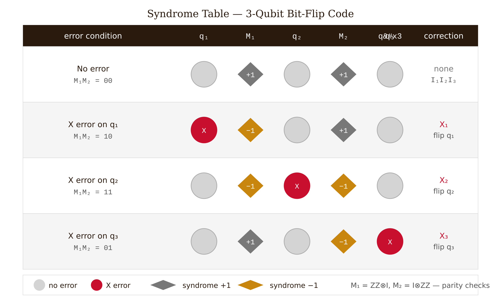
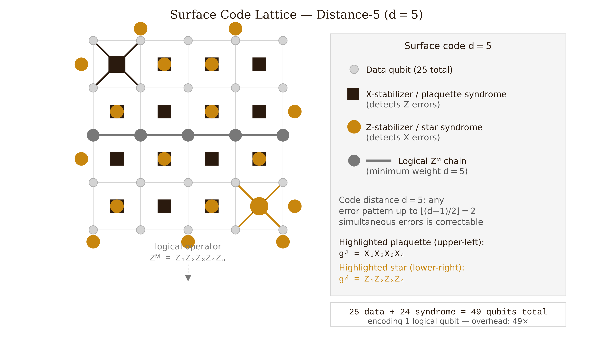
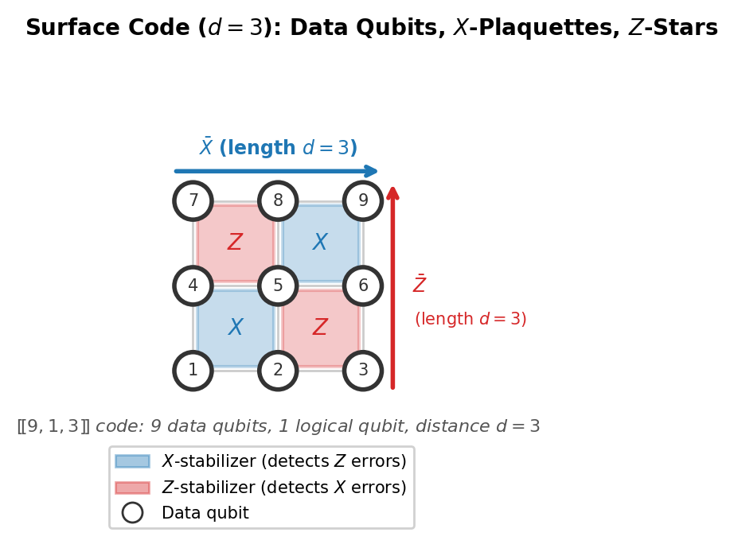
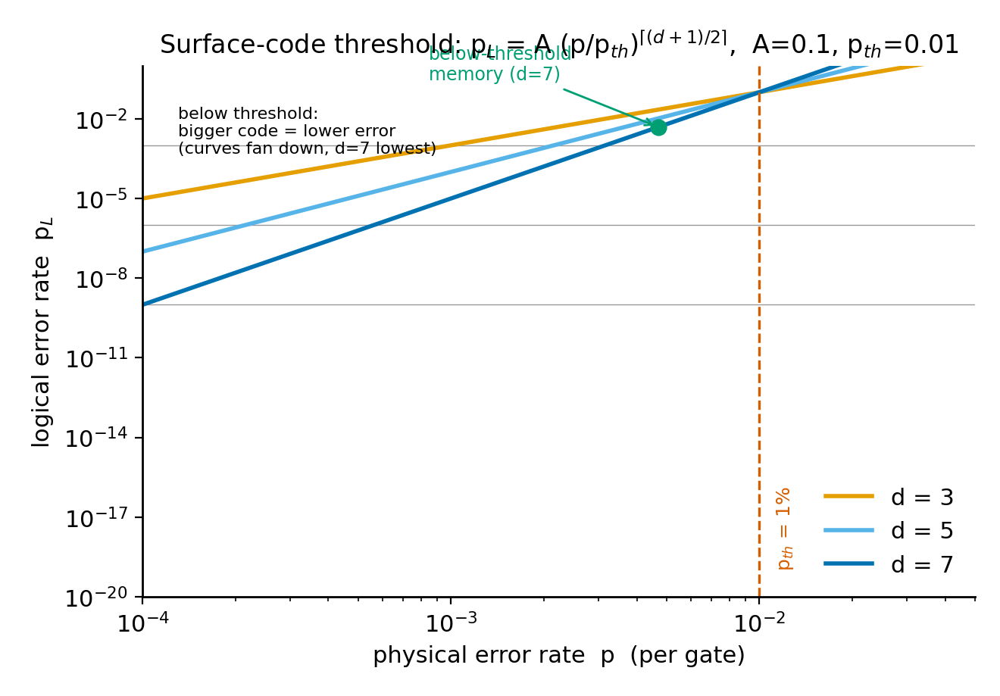
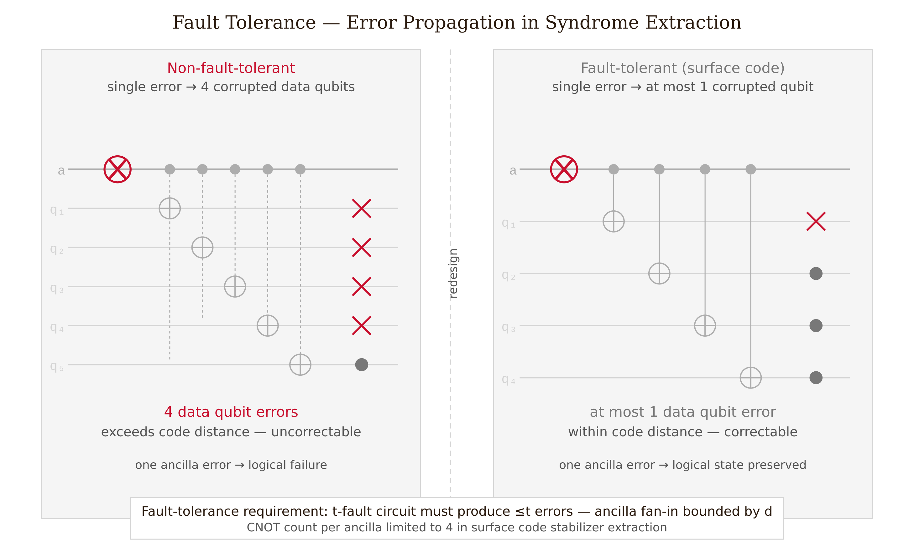
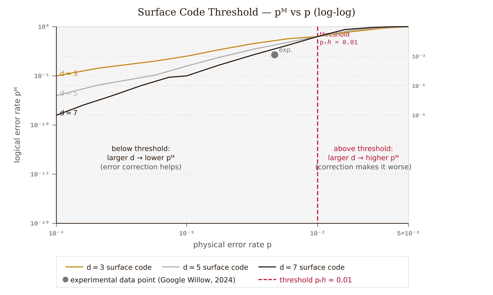

# Chapter 9 — Error and the Threshold Theorem

In 1994, Peter Shor published an algorithm that, run on a large enough quantum computer, would factor a 2,000-bit RSA key in hours. The physics community faced an immediate problem: qubits decay in microseconds.

The obvious fix — copy the qubit three times and take a majority vote, exactly as classical engineers do with every RAID disk and every satellite — is ruled out by quantum mechanics. The no-cloning theorem is not an engineering inconvenience. It is a theorem: no unitary operation maps $|\psi\rangle|0\rangle \to |\psi\rangle|\psi\rangle$ for all $|\psi\rangle$. The proof is one paragraph of linear algebra.

In 1995, Shor found a different approach — not by copying qubits, but by hiding their information inside entanglement. Quantum error correction is possible, it does not require reading the encoded state, and there is a threshold — a critical physical error rate below which a logical qubit can be made as reliable as needed.

That threshold theorem remained theoretical for nearly three decades. In December 2024, Google's Willow chip demonstrated it in hardware. In January 2026, QuEra's neutral-atom processor operated 96 logical qubits on 448 physical atoms. The engineering is young; the mathematics has been settled since 1997.

---

## Why Classical Redundancy Fails

The classical three-bit repetition code works as follows: encode $0 \to 000$ and $1 \to 111$; if one bit flips (say to $010$), majority vote returns $0$. To adapt this for qubits, one would encode $|0\rangle \to |000\rangle$ and $|1\rangle \to |111\rangle$. An arbitrary logical qubit $|\psi\rangle = \alpha|0\rangle + \beta|1\rangle$ would become $\alpha|000\rangle + \beta|111\rangle$.

To "correct" the code the classical way, one would measure each qubit and take the majority. Measuring the first qubit collapses the superposition — the encoded information is destroyed.

The resolution is to measure something weaker than the qubits themselves. Instead of measuring *what* the qubits are, we measure *parity relationships between* them. This is the key move.

---

## Errors Are Continuous but Correctable

A general single-qubit error acting on a density matrix can be written with Kraus operators:

$$\mathcal{E}(\hat\rho) = \sum_k E_k\hat\rho E_k^\dagger, \qquad \sum_k E_k^\dagger E_k = \hat I.$$

Any $2\times 2$ matrix is a linear combination of $\{I, X, Y, Z\}$, so:

$$E_k = a_k I + b_k X + c_k Y + d_k Z.$$

Every conceivable single-qubit error — a tiny rotation, a partial dephasing, a correlated amplitude-and-phase perturbation — is a linear combination of four operators. The key insight, stated precisely by Knill and Laflamme in 1997, is:

*If a code can detect and correct* $X$ *errors and* $Z$ *errors independently, it corrects any single-qubit error whatsoever.*

The continuous error space is spanned by four basis errors. Correct the basis; correct everything. This is the digitization of errors.

The three types of basis errors are: bit-flip ($X$: $|0\rangle \leftrightarrow |1\rangle$), phase-flip ($Z$: $|0\rangle \to |0\rangle$, $|1\rangle \to -|1\rangle$), and combined ($Y = iXZ$: both simultaneously).

---

## The 3-Qubit Bit-Flip Code

We encode one logical qubit in three physical qubits:

$$|\bar 0\rangle = |000\rangle, \qquad |\bar 1\rangle = |111\rangle, \qquad |\bar\psi\rangle = \alpha|000\rangle + \beta|111\rangle.$$

The encoding circuit uses two CNOT gates: CNOT from qubit 1 to qubit 2, then CNOT from qubit 1 to qubit 3. Starting from $(\alpha|0\rangle + \beta|1\rangle)|00\rangle$, the result is $\alpha|000\rangle + \beta|111\rangle$.

Suppose a single bit-flip $X$ acts on qubit 2. The state becomes $\alpha|010\rangle + \beta|101\rangle$. To diagnose the error without measuring the qubits, we introduce two ancilla qubits and measure the **parity observables**:

$$M_1 = Z_1Z_2, \qquad M_2 = Z_2Z_3.$$

These are the **stabilizers** of the code. Each has eigenvalues $\pm 1$.

For the error state $\alpha|010\rangle + \beta|101\rangle$: qubit 1 and qubit 2 have different $z$-eigenvalues in every term, so $\langle M_1\rangle = -1$; qubit 2 and qubit 3 also differ in every term, so $\langle M_2\rangle = -1$. The **syndrome** is $(-1, -1)$.

The full syndrome table:

<!-- → [TABLE: 3-qubit bit-flip code syndrome table — four rows (No error, X₁, X₂, X₃), columns: Error, Syndrome (M₁,M₂), Correction — with the syndrome pattern shown clearly: (+1,+1), (−1,+1), (−1,−1), (+1,−1)] -->

*Figure 9.3 — Syndrome table for the 3-qubit bit-flip code: each row shows one error case (no error, $X_1$, $X_2$, $X_3$) with the corresponding parity syndrome outcomes $(M_1, M_2)$, demonstrating that each error maps to a unique syndrome without revealing the encoded amplitudes.*

Four outcomes; four unambiguous diagnoses. What was measured: not the qubit values $\alpha$ or $\beta$, but only the parity structure of errors. The amplitudes appear in every row — they are invisible to the syndrome measurement. We apply the correction and the logical state is restored.

The syndrome operators commute with the logical operators $\bar Z = Z_1Z_2Z_3$ and $\bar X = X_1X_2X_3$ by construction. Measuring the syndrome gives no information about the logical state.

---

## The Phase-Flip Code and the Shor Code

Bit-flip codes correct $X$ errors. To correct $Z$ errors, we work in the $X$ basis:

$$|+\rangle = \frac{|0\rangle + |1\rangle}{\sqrt{2}}, \qquad |-\rangle = \frac{|0\rangle - |1\rangle}{\sqrt{2}}.$$

The phase-flip code encodes $|\bar 0\rangle = |{+}{+}{+}\rangle$, $|\bar 1\rangle = |{-}{-}{-}\rangle$. A $Z$ error flips the sign on one qubit's $|\pm\rangle$ state — a bit flip in the $X$ basis — and the stabilizers $X_1X_2$ and $X_2X_3$ detect it.

In 1995, Shor combined the two codes by concatenation: the phase-flip code protects against $Z$ errors and the bit-flip code protects against $X$ errors, nested one inside the other. The encoding:

$$|\bar 0\rangle = \frac{1}{2\sqrt{2}}\bigl(|000\rangle + |111\rangle\bigr)^{\otimes 3}, \qquad |\bar 1\rangle = \frac{1}{2\sqrt{2}}\bigl(|000\rangle - |111\rangle\bigr)^{\otimes 3}.$$

Nine physical qubits encode one logical qubit. The code corrects an arbitrary single-qubit error — any combination of $X$, $Y$, and $Z$ — because the outer level corrects $Z$ errors and the inner level corrects $X$ errors. $Y = iXZ$ is corrected by both layers simultaneously. The Shor code is not optimal, but it is the first existence proof that quantum error correction is possible.

---

## The Stabilizer Formalism

The stabilizer formalism, developed by Gottesman in his 1997 Caltech PhD thesis, gives a unified language for all the codes above and for more powerful constructions.

A **stabilizer code** $\mathcal{C}$ is defined by an abelian subgroup $\mathcal{S}$ of the $n$-qubit Pauli group. The code space is:

$$\mathcal{C} = \{|\psi\rangle : s|\psi\rangle = |\psi\rangle \text{ for all } s \in \mathcal{S}\}.$$

Every element of $\mathcal{S}$ has $|\psi\rangle$ as a $+1$ eigenstate. An error $E$ either commutes with every $s \in \mathcal{S}$ (undetectable) or anti-commutes with at least one stabilizer (detectable — measuring that stabilizer returns $-1$, flagging the error without collapsing the code space).

The code is characterized by three numbers $[\![n, k, d]\!]$: $n$ physical qubits, $k$ logical qubits encoded ($k = n - |\mathcal{S}|$ where $|\mathcal{S}|$ counts independent generators), and $d$ the **code distance** — the minimum weight of a Pauli operator that acts non-trivially on the logical space without being detected. The code corrects any error of weight up to $t = \lfloor(d-1)/2\rfloor$.

The 3-qubit bit-flip code is $[\![3,1,1]\!]$. The Shor code is $[\![9,1,3]\!]$: distance 3, correcting any single-qubit error.

The stabilizer formalism is where error correction becomes computationally tractable. Instead of tracking $2^n$-dimensional state vectors, we track the $n-k$ generators of $\mathcal{S}$ — a polynomial description. Simulating a stabilizer code classically is efficient.

*Figure 9.4 — Surface code lattice ($d = 5$): data qubits at vertices, plaquette X-stabilizers (filled squares at face centers) and star Z-stabilizers (filled circles), with one highlighted plaquette and one highlighted star showing their four-qubit interactions, and a logical operator chain of length 5 crossing the lattice.*

---

## The Surface Code

The **surface code** (Kitaev 1997/2003; Fowler et al. 2012) is approximately a $[\![2d^2, 1, d]\!]$ code for a $d\times d$ array of data qubits. Two types of stabilizers are measured:

$X$-**stabilizers** (plaquette operators): $X$ acting on the four data qubits around a square face. Detects $Z$ errors. $Z$-**stabilizers** (star operators): $Z$ acting on the four data qubits surrounding a vertex. Detects $X$ errors.

Every stabilizer involves only nearest-neighbor qubits — the feature that makes the surface code compatible with 2D chip architectures.

<!-- → [FIGURE: surface code geometry — d=3 example showing 9 data qubits (circles) on a square lattice with 4 plaquette X-stabilizers (squares in faces) and 4 star Z-stabilizers (stars at vertices); label the logical X̄ chain running left-to-right and the logical Z̄ chain running top-to-bottom, both of length d=3] -->

*Figure 9.1 — surface code geometry — d=3 example showing 9 data qubits (circles) on a square lattice with 4 plaquette X-stabilizers (squares in faces)…*

An error becomes undetectable only if it forms a chain connecting opposite boundaries — a chain of length $d$. Below threshold, the probability of $d$ simultaneous errors drops faster than the gain from increasing $d$, so larger codes perform better. Above threshold, this is not the case.

The surface code threshold is approximately $p_\text{th} \approx 1\%$ — high enough that current hardware can approach it. Concatenated codes achieve thresholds around $10^{-4}$ to $10^{-5}$, which is why the surface code displaced them as the practical target.

The logical error rate for a $\text{distance-}d$ surface code at physical error rate $p$ scales as:

$$\boxed{p_L \approx A\left(\frac{p}{p_\text{th}}\right)^{\lceil(d+1)/2\rceil},}$$

with $A \approx 0.1$. For $p < p_\text{th}$, each increase in $d$ by 2 suppresses $p_L$ by another factor of $(p/p_\text{th}) < 1$. The code gets better as it gets larger.

<!-- → [CHART: log-log plot of p_L vs p for d=3, 5, 7 — three lines converging at p=p_th where all equal A=0.1, fanning apart below (d=7 lowest) and above (d=7 highest); threshold marked by dashed vertical line; Willow data point marked] -->

*Figure 9.2 — log-log plot of p_L vs p for d=3, 5, 7 — three lines converging at p=p_th where all equal A=0.1, fanning apart below (d=7 lowest) and above…*

---

## Fault Tolerance: The Harder Problem

Error correction detects and reverses errors on data qubits. The syndrome measurement circuit itself, however, uses ancilla qubits and gates — and those can have errors too. A single ancilla error during syndrome extraction can propagate through the circuit and affect multiple data qubits. Two data qubits flipped simultaneously: a distance-3 code that can only correct one error fails.

**Fault tolerance** is the additional requirement that single errors in the syndrome circuit cause at most one logical error. This demands careful ancilla circuit design: ancillas should not interact with more data qubits than the code can correct. Shor's 1996 construction was the first proof that fault-tolerant computation is achievable.

The distinction matters in practice. A code might be an excellent error-correcting code but fail to be fault-tolerant if its syndrome extraction circuit allows error propagation. The surface code is designed so that each syndrome qubit touches exactly four data qubits — single syndrome errors propagate to at most one data-qubit error, which the code can still correct.

*Figure 9.6 — Fault tolerance versus error correction: in a non-fault-tolerant circuit (left), a single ancilla error propagates to multiple data qubits; in a fault-tolerant circuit (right), each ancilla interacts with at most four data qubits so a single error propagates to at most one.*

---

## The Threshold Theorem

The threshold theorem (proved independently by Aharonov and Ben-Or, 1997/1999; Knill, Laflamme, and Zurek, 1998; Kitaev, 1997) is the central theoretical result:

*There exists a threshold error rate* $p_\text{th}$ *such that, if every physical gate error rate* $p < p_\text{th}$, *fault-tolerant quantum computation can be performed on circuits of arbitrary depth with only polylogarithmic overhead.*

"Below threshold, bigger codes are better" is the intuitive statement. "Arbitrarily low logical error rate by scaling the code" is the precise statement. "The threshold is not zero" is why the result is significant — we do not need perfect hardware, just sufficiently good hardware.

The overhead is substantial. A $\text{distance-}d$ surface code requires approximately $2d^2$ physical qubits per logical qubit. To achieve $p_L = 10^{-15}$ at physical error rate $p = 0.1\%$, one needs $d \approx 25$, implying roughly 1,250 physical qubits per logical qubit. A 1,000-logical-qubit fault-tolerant computer might require 1–10 million physical qubits. Current hardware has $10^2$ to $10^3$ physical qubits. The gap is large; the timeline is contested.

*Figure 9.5 — Surface code threshold on log-log axes: logical error rate $p_L$ versus physical error rate $p$ for $d = 3, 5, 7$; curves cross at the threshold $p_\text{th} \approx 1\%$, below which larger codes suppress errors faster, with the experimental Willow data point shown on the $d = 7$ curve.*

---

## Recent Experimental Milestones

**Google Willow (December 2024, Nature 2025).** Acharya et al. ran distance-3, -5, and -7 surface codes on the 105-qubit Willow superconducting processor. The logical error rate was suppressed by a factor of $\Lambda = 2.14 \pm 0.02$ per unit increase in code distance by 2. The distance-7 code achieved $p_L = 0.143\% \pm 0.003\%$ per error-correction cycle and preserved quantum information $2.4 \pm 0.3\times$ longer than the best individual physical qubit. This was the first unambiguous experimental demonstration that the surface code threshold theorem works in hardware — that below-threshold scaling is not just a theorem but a measured fact.

Note carefully: this demonstrates below-threshold quantum *memory*, not yet below-threshold fault-tolerant universal *computation*. Below-threshold computation requires transversal logical gates and magic state distillation at the same scale.

**QuEra / Harvard / MIT (January 2026).** Bluvstein and colleagues demonstrated 96 logical qubits from 448 physical atoms on a neutral-atom array, using $[\![16,6,4]\!]$ high-rate codes. This is the largest logical-qubit-count demonstration to date at this writing. High-rate codes encode more logical qubits per physical qubit than the surface code, at the cost of smaller code distance and more complex syndrome circuits. Neutral atoms tolerate long-range connectivity that superconducting chips do not.

**Quantinuum + Microsoft (2024–2025).** 12 logical qubits on the H2 trapped-ion processor with 99.9%+ gate fidelity and error rates 800× below physical rates. In 2025, Quantinuum's Helios processor demonstrated 48 logical qubits and the first fully fault-tolerant gate set with non-Clifford gates at logical error rates below physical error rates.

These records will be superseded before this book is in print. What will not change: the threshold theorem, the digitization of errors, and the stabilizer structure. Track current records in the literature; the framework here is durable.

---

## A Worked Calculation: Full QEC Cycle for the 3-Qubit Code

We trace the full cycle — encode, error, syndrome, correct, verify — for the simplest code.

**Setup.** Logical state $|\bar\psi\rangle = \alpha|000\rangle + \beta|111\rangle$. A bit-flip $X$ acts on qubit 2. Error state: $|\bar\psi_e\rangle = \alpha|010\rangle + \beta|101\rangle$.

**Step 1: Prepare ancillas.** Two ancilla qubits in $|0\rangle$:

$$|\Psi\rangle = (\alpha|010\rangle + \beta|101\rangle)|00\rangle.$$

**Step 2: Measure** $M_1 = Z_1Z_2$. We write the parity of $(q_1, q_2)$ into ancilla 1 via CNOT gates. In the state $\alpha|010\rangle + \beta|101\rangle$:

- Term $|010\rangle$: qubit 1 is $|0\rangle$, qubit 2 is $|1\rangle$. Parity: odd.
- Term $|101\rangle$: qubit 1 is $|1\rangle$, qubit 2 is $|0\rangle$. Parity: odd.

Both terms have the same parity, so measuring ancilla 1 returns a definite $-1$ without collapsing the $(\alpha, \beta)$ superposition. Ancilla 1 reads $-1$.

**Step 3: Measure** $M_2 = Z_2Z_3$. Similarly:

- Term $|010\rangle$: qubit 2 is $|1\rangle$, qubit 3 is $|0\rangle$. Parity: odd.
- Term $|101\rangle$: qubit 2 is $|0\rangle$, qubit 3 is $|1\rangle$. Parity: odd.

Ancilla 2 reads $-1$. Syndrome: $(-1, -1)$.

**Step 4: Look up.** Syndrome $(-1, -1)$ means error on qubit 2.

**Step 5: Correct.** Apply $X_2$:

$$X_2(\alpha|010\rangle + \beta|101\rangle) = \alpha|000\rangle + \beta|111\rangle = |\bar\psi\rangle.$$

The logical state is restored. The values $\alpha$ and $\beta$ were never measured, never read, never disturbed. The syndrome told us *where* the error was, not *what* the qubit is.

**The limit.** If two qubits are simultaneously flipped (say qubits 1 and 3), the syndrome is $(-1, -1)$ — the same syndrome as a single $X$ error on qubit 2. The decoder applies $X_2$, and the net operation $X_1X_2X_3 = \bar{X}$ is a logical bit-flip. A $[\![3,1,1]\!]$ code that encounters two errors fails. That is why code distance matters, and why the surface code uses large $d$.

---

## Open Questions and Limitations

**The overhead problem.** The threshold theorem guarantees arbitrarily low logical error rates, but at cost: roughly $2d^2$ physical qubits per logical qubit. For a 1,000-logical-qubit fault-tolerant quantum computer running Shor's algorithm at $p_L = 10^{-15}$, the required code distance is approximately $d \approx 25$, meaning roughly 1.25 million physical qubits total. Current processors have $\sim 10^3$ physical qubits. The gap is large; the timeline is contested.

**Quantum LDPC codes.** The surface code's overhead scales as $O(d^2)$ physical qubits per logical qubit. Recent constructions — quantum low-density parity-check (qLDPC) codes — achieve constant encoding rate with linear distance, meaning overhead per logical qubit can in principle be $O(\log n)$ rather than $O(d^2)$. These constructions are mathematically proven but have not yet been demonstrated experimentally at scale, and their connectivity requirements are challenging for planar architectures. Multiple groups began investigating these experimentally in 2024–2026.

**Classical decoding latency.** Real-time syndrome decoding is a bottleneck that threshold theorem analysis often ignores. The syndrome extraction cycle takes microseconds; the classical decoder must keep up. Minimum-weight perfect matching runs in roughly $O(n\log n)$ per syndrome cycle but requires FPGA or GPU acceleration at scale. Neural-network decoders are faster but require training. The effective logical clock rate is limited by the classical decoder, not just the hardware.

---

## Exercises

**Warm-up**

1. *[Digitization of errors]* The "small rotation" error $E = \cos\epsilon\cdot I + i\sin\epsilon\cdot X$ is already in Pauli form. For small $\epsilon$, it has probability $\approx\epsilon^2$ of causing an $X$ error and probability $\approx 1-\epsilon^2$ of leaving the qubit unchanged. Explain why a code that corrects $X$ errors corrects this continuous rotation error too, even though the error is not exactly $X$.
*What this tests: the digitization principle — continuous errors are corrected once their discrete components are corrected.*

2. *[Syndrome computation]* For the 3-qubit bit-flip code with $|\bar\psi\rangle = \alpha|000\rangle + \beta|111\rangle$, compute the syndrome $(M_1, M_2)$ for each of the four cases: no error, $X_1$, $X_2$, $X_3$. Write the error state explicitly in each case, compute the eigenvalue of $Z_1Z_2$ and $Z_2Z_3$, verify that both terms in the superposition give the same eigenvalue, and confirm the syndrome table.
*What this tests: the key property that both terms in the superposition give the same syndrome eigenvalue, so the measurement is definite without collapsing the logical state.*

3. *[No-cloning and QEC strategy]* Explain in one paragraph why the classical three-bit majority-vote strategy cannot be applied directly to qubits (invoke the no-cloning theorem precisely). Then explain what QEC does instead.
*What this tests: connecting the no-cloning constraint to the stabilizer strategy — measuring parity relations rather than qubit values.*

**Application**

4. *[Threshold scaling formula]* The surface code logical error rate scales as $p_L \approx A(p/p_\text{th})^{\lceil(d+1)/2\rceil}$ with $p_\text{th} \approx 0.01$ and $A = 0.1$. (a) For $p = 0.002$, compute $p_L$ for $d = 3, 5, 7$. (b) For $p = 0.02$, compute $p_L$ for the same distances. (c) At which value of $p$ do the $d = 3$ and $d = 5$ curves cross? What does the crossing represent physically?
*What this tests: numerically demonstrating the threshold crossover — seeing concretely that below-threshold big codes are better and above-threshold they are worse.*

5. *[Stabilizer formalism; code distance]* The $[\![5,1,3]\!]$ code (smallest code correcting any single-qubit error) has stabilizers $XZZXI$, $IXZZX$, $XIXZZ$, $ZXIXZ$. (a) Verify that these four operators commute pairwise. (b) Show that an $X_1$ error anti-commutes with at least one stabilizer, so it is detectable. (c) What is the code distance and how many errors does it correct?
*What this tests: working with the stabilizer formalism beyond the simple 3-qubit case; confirming that anti-commutativity detects errors.*

6. *[Google Willow result]* Acharya et al. (2024) report a suppression factor $\Lambda = 2.14$ per unit increase in distance by 2. The threshold scaling predicts $\Lambda \approx p_\text{th}/p$. (a) Use $\Lambda = 2.14$ and $p_\text{th} = 0.01$ to estimate the effective physical error rate on Willow. (b) The distance-7 code achieved $p_L = 0.143\%$ per cycle. Use $p_L \approx A(p/p_\text{th})^4$ (since $\lceil 8/2\rceil = 4$) and your estimated $p$ to find $A$. (c) What distance $d$ would achieve $p_L = 10^{-6}$?
*What this tests: extracting physical parameters from an experimental result and using the threshold formula to extrapolate — exactly the exercise any experimentalist runs.*

**Synthesis**

7. *[Syndrome circuit design]* Design the syndrome measurement circuit for the 3-qubit bit-flip code. The circuit uses 5 qubits total: 3 data qubits in $\alpha|000\rangle + \beta|111\rangle$ and 2 ancilla qubits in $|0\rangle$. Write the gate sequence (CNOTs and measurements) that extracts $M_1 = Z_1Z_2$ and $M_2 = Z_2Z_3$ into ancilla qubits, then measures the ancillas. Verify: the ancilla measurements cannot reveal $\alpha$ or $\beta$. Explain why.
*What this tests: the circuit-level realization of syndrome measurement; seeing concretely why the ancilla outputs depend only on the error location and not on the encoded state.*

8. *[Shor code structure]* The 9-qubit Shor code encodes $|\bar 0\rangle = \tfrac{1}{2\sqrt{2}}(|000\rangle + |111\rangle)^{\otimes 3}$ and $|\bar 1\rangle = \tfrac{1}{2\sqrt{2}}(|000\rangle - |111\rangle)^{\otimes 3}$. (a) Identify which part of the encoding corrects $X$ errors and which corrects $Z$ errors. (b) The $Z$ stabilizers of the inner code are $Z_1Z_2$, $Z_2Z_3$, $Z_4Z_5$, $Z_5Z_6$, $Z_7Z_8$, $Z_8Z_9$. Write the $X$ stabilizers for the outer level. (c) Show that a $Y_1 = iX_1Z_1$ error is corrected by the code.
*What this tests: understanding the concatenation structure — seeing explicitly how two separate codes are stitched together to handle all Pauli errors.*

**Challenge**

9. *[Fault tolerance vs. error correction]* Consider a syndrome measurement circuit for the 3-qubit bit-flip code in which both CNOTs for measuring $M_1$ go through a *single* ancilla qubit (so the ancilla interacts with both qubit 1 and qubit 2). A single error on the ancilla during the first CNOT can be recorded and then propagated to both qubits during the second CNOT. (a) Show explicitly how a single ancilla error in this circuit can flip both qubit 1 and qubit 2 after the CNOT operations. (b) For a $[\![3,1,1]\!]$ code, a two-qubit error is uncorrectable. Explain how this ancilla error causes a logical failure despite the single physical error. (c) Describe a modification to the syndrome extraction circuit — using separate ancillas for each stabilizer measurement — that prevents this error propagation. This is the basic idea behind fault-tolerant syndrome extraction.
*What this tests: the concrete distinction between error-correcting codes and fault-tolerant circuits; seeing why fault tolerance is an additional requirement beyond just having a good code.*

---

## References

Wootters, W. K., & Zurek, W. H. (1982). A single quantum cannot be cloned. *Nature*, 299, 802–803.

Shor, P. W. (1995). Scheme for reducing decoherence in quantum computer memory. *Physical Review A*, 52, R2493.

Shor, P. W. (1996). Fault-tolerant quantum computation. *Proceedings of the 37th Annual Symposium on Foundations of Computer Science*, 56–65.

Knill, E., Laflamme, R., & Zurek, W. H. (1998). Resilient quantum computation: error models and thresholds. *Science*, 279, 342–345.

Gottesman, D. (1997). Stabilizer codes and quantum error correction. PhD thesis, California Institute of Technology. arXiv:quant-ph/9705052.

Kitaev, A. Yu. (2003). Fault-tolerant quantum computation by anyons. *Annals of Physics*, 303, 2–30.

Fowler, A. G., Martinis, J. M. et al. (2012). Surface codes: towards practical large-scale quantum computation. *Physical Review A*, 86, 032324.

Acharya, R. et al. (Google Quantum AI). (2025). Quantum error correction below the surface code threshold. *Nature*, 638, 920–926. arXiv:2408.13687.

Bluvstein, D. et al. (QuEra/Harvard/MIT). (2024). Logical quantum processor based on reconfigurable atom arrays. *Nature*, 626, 58–65.

Sivak, V. V. et al. (Yale). (2023). Real-time quantum error correction beyond break-even. *Nature*, 616, 50–55.

Nielsen, M. A., & Chuang, I. L. (2000). *Quantum Computation and Quantum Information*. Cambridge University Press. Chapter 10.

